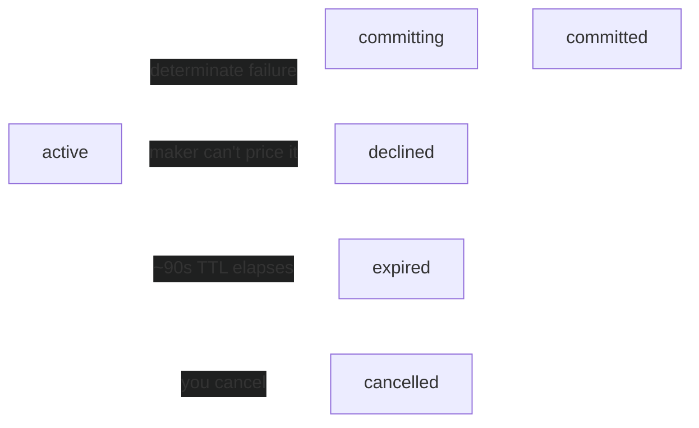

Once a parlay is live on-chain, you don't have to wait for its markets to resolve. You can close it early by opening a **cashout request** and accepting a **buyback** price from the market maker that backs the position.

Your stake is always returned. The buyback quote is the net amount on top of it: the maker pays you when your position is in profit, and you pay the maker when it's underwater (gross of a profit fee). A cashout never touches your stake beyond that net.

A cashout is a short-lived request with its own lifecycle, separate from the parlay's status. It's offered to a single market maker, the same one that took the other side of your trade, so there's no auction here. That one maker either streams you a live buyback quote or refuses.



## Before you start

A position is eligible for cashout when all of the following hold:

- It is **live on-chain** (the parlay's RFQ status is `executed`).
- You **own** it.
- It has a **counterparty market maker** assigned.
- It is **not inside the near-expiry buffer** of its market end. Close to the underlying's resolution, cashout is refused so you settle normally instead.

You open a cashout against the position's on-chain `position_id`, a 16-byte hex string. Read it from the parlay object once the parlay is `executed`:

```bash
GET /v1/rfqs/<id>          # position_id is set here once executed
```

See [Get parlay](/api-reference/parlays/get) for the full object.

## Walk through a cashout

<Steps>
  <Step title="Open the cashout request">
    Post the `position_id`. Totalis validates ownership and eligibility, then offers the request to the position's maker.

    ```bash
    POST /v1/cashout-requests
    { "position_id": "9f86d08818844f86d08818844f86d088" }
    ```

    The response is the new request. A few fields matter for what comes next:

    - **`id`** is the cashout request UUID. You use it on the stream and the commit call.
    - **`user_stake`** is the net stake that comes back to you on any successful buyback.
    - **`expires_at`** is the request's own TTL horizon, roughly 90 seconds out. That's not the position's market end; that's `position_expires_at`.

    See [Create cashout request](/api-reference/quote-service/cashout-create) for every field.
  </Step>

  <Step title="Watch the buyback quote arrive">
    Open the SSE stream and wait for the maker to price it.

    ```bash
    GET /v1/cashout-requests/<id>/stream    # SSE: live buyback quote + terminal status
    ```

    The stream sends a `best_quote` event whenever the maker's quote changes, and one terminal `status` event when the request leaves `active` or `committing`, after which it closes. Because a cashout has a single maker, `best_quote` is that maker's quote, or `null` when none is live.

    ```json
    {
      "book_seq": 3,
      "version": 1,
      "best_quote": {
        "id": "q1w2e3r4-...",
        "buyback_price": 41.5,
        "mm_pays_user": true,
        "valid_until": "2026-06-01T18:45:45.000Z",
        "net_received": 66.25
      }
    }
    ```

    Read [Reading the quote](#reading-the-quote) below for what each field means. See [Stream cashout quote](/api-reference/quote-service/cashout-stream) for the wire format and a fetch-based reader (native `EventSource` can't send the `X-API-Key` header).
  </Step>

  <Step title="Commit while the quote is live">
    Accept the live quote. There's no body and no maker-confirm round-trip: the quote is the price, and signatures are handled server-side at execution.

    ```bash
    POST /v1/cashout-requests/<id>/commit
    ```

    On success the buyback executes on-chain, your stake is released, and the parlay flips to `bought_back`. The realized result lands on the parlay's `cashout` object. See [Commit cashout](/api-reference/quote-service/cashout-commit).

    A quote is only valid until its `valid_until`. If it lapses before you commit, the call returns `409` with `reason: quote_expired`; wait for the next `best_quote` on the stream and commit that one instead.
  </Step>
</Steps>

## Reading the quote

The buyback quote is directional. It tells you which way money moves and how much, on top of your returned stake.

| Field | Meaning |
| --- | --- |
| `buyback_price` | The directional net `amount` (USDC, ≥ 0), gross of the profit fee. |
| `mm_pays_user` | `true` when your position is in profit and the maker pays you. `false` when you are underwater and you pay the maker. |
| `net_received` | The cash you actually walk away with: your stake plus or minus the amount, net of fees. Present only when it can be computed, omitted otherwise. Never negative. |
| `valid_until` | When this quote expires. Commit before then. |
| `book_seq` | Increments on every quote change, so you can tell a fresh quote from a duplicate and detect a missed update. |

In the example above, a stake of `24.75` plus a `buyback_price` of `41.5` gives a `net_received` of `66.25`. When `mm_pays_user` is `false`, the amount is deducted instead, and `net_received` is what is left of your stake after paying the maker.

Prefer `net_received` for anything you show a user. It's the single number that answers "what do I get back", and it already accounts for the fee so you don't have to re-derive it.

## How a cashout ends

The terminal `status` on the stream tells you how the request resolved:

| Terminal `status` | Meaning |
| --- | --- |
| `committed` | The buyback landed on-chain. The parlay is now `bought_back`. |
| `declined` | The maker permanently refused to price it (see below). |
| `expired` | The ~90 second TTL elapsed with no commit. |
| `cancelled` | You cancelled the request while it was still `active`. |

You can walk away from an `active` request at any time with [Cancel cashout request](/api-reference/quote-service/cashout-cancel). Once a request is `committing` or later, it can no longer be cancelled.

### When the maker declines

A cashout is offered to one maker, so if that maker can't price the position, the request ends in `declined` and there's no fallback maker to pick it up. A decline is permanent for that request. This usually means a leg is already decided or sits too close to certainty to re-price reliably. You can still let the parlay settle normally, and if conditions change you can open a fresh cashout request later. The pricing gates that produce a decline are documented for makers under [Pricing early cashouts](/guides/market-maker#pricing-early-cashouts).

### When a commit is indeterminate

<Note>
A commit can return `503` with `details.indeterminate: true`. This does **not** mean the buyback failed. It means the on-chain outcome isn't known yet (a timeout or a transient RPC blip), so the request stays `committing` and a reconciler settles it against on-chain state. Don't treat it as a failure and don't retry blindly, or you risk acting as if nothing happened when it may have. Reopen the stream and wait for the terminal `status`. A determinate failure is a `409`, and only then is it safe to retry.
</Note>

## How cashout differs from the forward flow

If you already know the [quote request flow](/guides/live-quote-requests), a few things are deliberately different here:

- **One maker, no auction.** The buyback comes from the position's existing counterparty, not a field of competing quotes.
- **The quote is the price.** Committing executes directly. There is no separate maker confirmation step.
- **Short TTL.** A request lives about 90 seconds, versus the longer parlay windows.
- **One terminal event.** The stream sends a single `status` frame and closes. It doesn't follow with a second, more specific event the way the quote-request stream does.

## Reference

| Item | Value |
| --- | --- |
| Request TTL | ~90 s (`expires_at`) |
| Cancellable while | `active` only |
| Commit idempotency | per (request, user), cached 5 min |
| Stake | always refunded on a successful buyback |
| Buyback direction | `mm_pays_user` true in profit, false underwater |

<CardGroup cols={2}>
  <Card title="Parlay lifecycle" icon="arrows-spin" href="/guides/lifecycle">
    Where cashout sits in the full path from quote request to settlement.
  </Card>
  <Card title="Create cashout request" icon="play" href="/api-reference/quote-service/cashout-create">
    Open a request against a position's on-chain id.
  </Card>
  <Card title="Stream cashout quote" icon="bolt" href="/api-reference/quote-service/cashout-stream">
    Follow the live buyback quote and terminal status over SSE.
  </Card>
  <Card title="Pricing early cashouts (MMs)" icon="chart-line" href="/guides/market-maker#pricing-early-cashouts">
    The maker side: fair value, exit edge, and when a request is declined.
  </Card>
</CardGroup>
