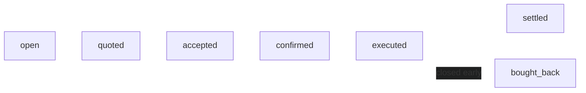
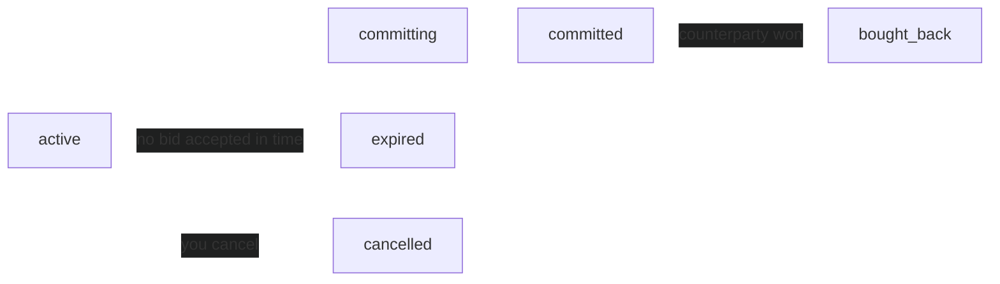

A parlay starts as a **quote request** — your legs, priced live by market makers — and becomes a real **position** the moment you accept a quote. From there it settles automatically when the underlying markets resolve, or you can close it early.

You'll see this progression in the `status` field on the parlay (RFQ) object:



A parlay can also end at `cancelled` or `expired` before it's funded.

## Place a parlay

<Steps>
  <Step title="Open a quote request">
    Add 2–5 legs and a bet amount. Each leg names a market and a side (`yes` / `no`). The `market_ticker` is venue-specific:

    - **Kalshi** — the market ticker, e.g. `KXBTC-25FEB07-T100000`.
    - **Polymarket** — the `condition_id` (the `0x`-prefixed hex string), not the slug or question id. Both sides of a binary share one `condition_id`, distinguished by `side`.

    ```bash
    POST /v1/quote-requests
    {
      "legs": [
        { "market_ticker": "KXBTC-25FEB07-T100000", "side": "yes", "venue": "kalshi" },
        { "market_ticker": "0x4d2…",                "side": "no",  "venue": "polymarket" }
      ],
      "bet_amount": 25
    }
    ```

    Totalis validates each market, applies leg-exclusion rules (correlated legs can't be combined), and broadcasts the request to market makers. See [Create quote request](/api-reference/quote-service/create) for the full field reference.

    The amount actually locked is your bet amount minus a 1% taker fee, charged upfront when you place the trade — so don't expect the locked stake to exactly match `bet_amount`.
  </Step>

  <Step title="Market makers quote it">
    Makers stream the request and submit quotes with payout odds. You watch them arrive live on the quote-request [stream](/api-reference/quote-service/stream). Each quote carries:

    - **`user_cost`**: your net stake, `bet_amount` minus the 1% taker fee.
    - **`total_payout`**: `user_cost * payout_odds`, what you receive if every leg wins. Odds apply to the net stake, not the gross `bet_amount`.
    - **`payout_odds`**: the multiple on your net stake.
    - **`book_seq`**: the SSE event's sequence number, carried alongside the quote. You'll need it later to prove your pricing was current when you commit.
  </Step>

  <Step title="Commit the best quote">
    Accept a quote to lock the trade. Totalis selects the best still-valid quote for the version you saw and creates the parlay with that quote already accepted.

    ```bash
    POST /v1/quote-requests/<id>/commit
    {
      "expected_version": 3,
      "displayed_quote_id": "<quote-id>",
      "displayed_quote_book_seq": 5,
      "min_payout_odds_seen": 4.0
    }
    ```

    The response returns the real `rfq_id`, the accepted quote, and the payout odds. **Status: `accepted`.**
  </Step>

  <Step title="The parlay funds on-chain">
    The maker confirms, and your stake and the maker's collateral lock atomically in [on-chain Solana vaults](/guides/vault-architecture). Gas is sponsored — you only ever need USDC.

    Status moves to `confirmed`, then `executed` once the position is live on-chain. If the maker doesn't confirm in time, the parlay reopens for other makers (or expires if its window has passed) and your funds are never touched.
  </Step>

  <Step title="It settles automatically">
    When every leg's market has resolved, the position settles:

    - **All legs win** — you receive the full payout: your stake plus the maker's collateral, minus a protocol fee on profit.
    - **Any leg loses** — your stake transfers to the maker (minus fee).

    **Status: `settled`.** Read the outcome and transaction signatures from [`GET /v1/rfqs/{id}`](/api-reference/parlays/get).
  </Step>
</Steps>

## Closing early (cashout)

Once a parlay is live (`executed`), you don't have to wait for settlement. You can open a short **cashout auction**: Totalis broadcasts it to every market maker, the highest live bid wins, and the price you accept is one all-in figure, which can be below your stake if the position has gone against you. Mechanically, your stake is returned and the difference settles as a separate transfer in whichever direction applies, so what you receive in total equals the all-in price.

A cashout is its own short-lived request, separate from the parlay's status:



<Steps>
  <Step title="Request a cashout">
    Read `position_id` from the parlay object ([`GET /v1/rfqs/{id}`](/api-reference/parlays/get)) once it's `executed` — it's set there and used to open the cashout.

    ```bash
    POST /v1/cashout-requests
    { "position_id": "<position-id>" }

    GET  /v1/cashout-requests/<id>/stream   # SSE: live buyback quote + status
    ```
  </Step>
  <Step title="Market makers bid on it">
    Every market maker sees the auction on their stream and can bid one all-in price; the auction lives about 10 seconds. Watch the [cashout stream](/api-reference/quote-service/cashout-stream) for the best live bid. Its `price_micro` is the total you'd receive.
  </Step>
  <Step title="Commit">
    ```bash
    POST /v1/cashout-requests/<id>/commit
    { "min_price_micro": <the price_micro you accepted> }
    ```

    `min_price_micro` is required: nothing is ever filled at a price you did not see. The exit executes on-chain and you receive the accepted price. If the winning bid came from the maker that backs your position, the position closes, the realized P&L lands on the parlay's `cashout` object, and the parlay becomes **`bought_back`**. If another maker won, they acquire the position instead and the parlay's status does not become `bought_back`.
  </Step>
</Steps>

## Status reference

The `status` on a parlay (RFQ):

| Status | Meaning |
| --- | --- |
| `open` | Awaiting quotes (or reopened after a maker missed confirmation). |
| `quoted` | At least one maker has quoted. |
| `accepted` | You committed a quote; awaiting maker confirmation. |
| `confirmed` | Maker confirmed; funding on-chain. |
| `executed` | Live on-chain — eligible for early cashout. |
| `settled` | Resolved and paid out. |
| `bought_back` | Closed early via cashout. |
| `cancelled` / `expired` | Ended before funding; no funds moved. |

Quotes carry their own status — `withdrawn` (the maker pulled it), `expired` (its validity lapsed), or `rejected` (you accepted a different quote on the same request).

## Limits

| Parameter | Constraint |
| --- | --- |
| Legs per parlay | 2–5 |
| Bet amount | 1–100 USDC |
| Payout odds | 1.0001× – 1000× |
| Quote validity | 5–60 s (default 15 s) |
| Quote request expiry | 300 s by default (configurable 30 s to 24 h), before commit |
| Maker confirmation window | 5 s by default |
