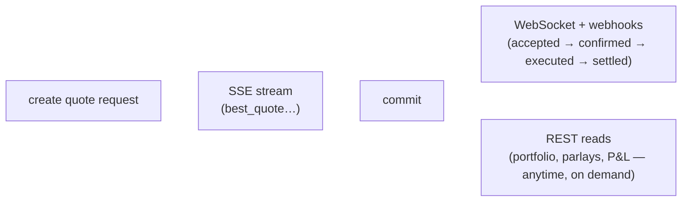

Totalis moves data over four channels. Each covers a different phase of a trade and a different delivery guarantee — pick by what you're doing, not by protocol preference:

<Note>
  Need the full moment by moment map — every event name on every channel, side by side, plus the field names that mean the same thing across them? See the [event catalog](/guides/event-catalog).
</Note>

| Channel | What it carries | Use it for |
| --- | --- | --- |
| [SSE streams](/api-reference/quote-service/stream) | **Pretrade pricing** — live `best_quote` updates on a quote request or cashout request | Watching prices while you decide whether to commit |
| [WebSocket](/guides/websocket) | **Posttrade events, live** — quote acceptance, confirmation, position created/settled | Live UIs and bots that hold a connection |
| [Webhooks](/guides/webhooks) | **Posttrade events, durable** — most of the same lifecycle moments as HMAC signed POSTs with retries and replay, plus one moment WebSocket doesn't carry at all (early cashout buyback — see the [event catalog](/guides/event-catalog#the-websocket-buyback-gap)) | Server systems of record that must never miss an event |
| [REST reads](/guides/reading-data) | **State on demand** — portfolio, parlays, settlement detail, P&L, balances | Backfill, reconciliation, on demand display |

All four authenticate with the same [API key](/guides/authentication).

## One trade, three phases

- **Pricing is SSE.** Every quote request gets its own stream at [`GET /v1/quote-requests/{id}/stream`](/api-reference/quote-service/stream); a cashout request gets one at [`GET /v1/cashout-requests/{id}/stream`](/api-reference/quote-service/cashout-stream). The stream exists only while the request is live and closes after a terminal event. Market makers watch the firehose variant, [`GET /v1/mm/quote-requests/stream`](/api-reference/quote-service-mm/stream).
- **From commit onward, it's events.** The moment you commit, the quote request becomes an RFQ and the SSE stream ends. Everything after — acceptance, confirmation, on chain execution, settlement — arrives on the [WebSocket](/guides/websocket) and as [webhooks](/guides/webhooks).
- **State is always readable.** The [read endpoints](/guides/reading-data) return current truth whenever you ask — they're how you backfill after downtime and reconcile what the push channels told you.

## WebSocket or webhooks?

Both deliver posttrade lifecycle events, and for most of the lifecycle they overlap. They differ in the delivery guarantee — and in one case, in coverage:

- **WebSocket** pushes to a *connected client* in real time. If you disconnect, missed events are not redelivered — on reconnect, reconcile with the [read endpoints](/guides/reading-data). Choose it for live UIs and trading bots where latency matters.
- **Webhooks** POST to *your server* with at least once delivery: HMAC signed, retried with backoff, dead lettered, and [replayable](/guides/webhooks#replaying-deliveries). Choose them for accounting, notifications, and any system of record.

<Warning>
  The two channels are not full parity: early cashout buyback (`position.bought_back`) is a **webhook only** event today, with no WebSocket equivalent. A latency sensitive bot that only holds a WebSocket connection won't learn a position was bought out until it reconciles against the [read endpoints](/guides/reading-data). See the [event catalog](/guides/event-catalog#the-websocket-buyback-gap) for the full picture.
</Warning>

Serious integrations often run both: the WebSocket for immediacy, webhooks for the durable record.

## Typical integrations

### Trading bot

1. Create a quote request — [`POST /v1/quote-requests`](/api-reference/quote-service/create).
2. Watch its [SSE stream](/api-reference/quote-service/stream) for `best_quote` events; store `book_seq` and the quote `id`.
3. [Commit](/api-reference/quote-service/commit) when the price is right.
4. Follow the trade live on the WebSocket [`rfq:{rfq_id}` channel](/guides/websocket#subscribing-to-channels), or durably via the [`parlay.status_changed`](/guides/webhooks#event-catalog) webhook.
5. Record the outcome from the `position.settled` webhook, or read it from [`GET /v1/rfqs/{id}`](/api-reference/parlays/get).

### Read only dashboard

1. Pull state with [`GET /v1/portfolio`](/api-reference/funds/portfolio), [`GET /v1/rfqs`](/api-reference/parlays/list), and [`GET /v1/pnl`](/api-reference/funds/pnl).
2. Subscribe to [`rfq:{rfq_id}`](/guides/websocket#subscribing-to-channels) on the WebSocket for live position updates.
3. On reconnect, [reconcile](/guides/reading-data#reconciling) against the read endpoints.

### Market maker

1. Stream quote requests and cashout requests from [`GET /v1/mm/quote-requests/stream`](/api-reference/quote-service-mm/stream); [heartbeat](/api-reference/quote-service-mm/heartbeat) every 30 seconds.
2. [Submit quotes](/api-reference/quote-service-mm/submit-quote) as requests arrive.
3. Listen on the WebSocket [`mm:quotes:{mm_id}` channel](/guides/websocket#subscribing-to-channels) for `quote:accepted`, then [confirm](/api-reference/mm/confirm-quote) before the deadline.
4. Keep the durable record with an [MM webhook endpoint](/guides/webhooks) (`?owner_kind=mm`).

See [Market making](/guides/market-maker) for the full loop, including cashout pricing.
