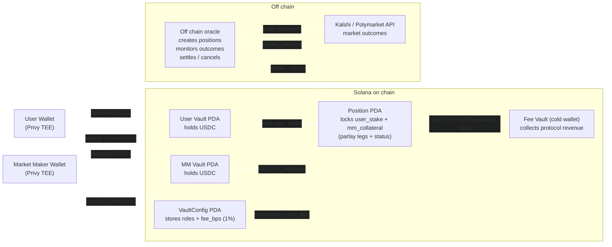

Totalis is **noncustodial**. Your funds sit in an on chain Solana vault that the protocol's program controls — not in a Totalis held account. You enable trading once by delegating signing permission — after that, placing, settling, and closing a parlay needs no signature from you.

## Your vault

You have one persistent vault, reused across every parlay. It tracks three balances:

| Balance | Meaning |
| --- | --- |
| **Gross** | Total USDC in the vault. |
| **Locked** | Collateral committed to your active positions. |
| **Free** | `gross − locked` — available to trade or withdraw. |

Read them any time from [`GET /v1/vault`](/api-reference/funds/get-vault). You fund the vault by sending USDC to your wallet (see [Funding](/guides/funding)); placing a parlay moves your stake into the vault and locks it in one atomic step.

## Delegated signing

Your wallet is a Privy embedded wallet whose private key lives inside a **Trusted Execution Environment (TEE)** — it never leaves the enclave, and not even Privy can extract it.

To trade, you grant Totalis permission to sign on your behalf inside that enclave (a one time consent in the app — see [Enable trading](/guides/funding#enable-trading-first)). This is **semicustodial**: you can revoke the permission any time, and Totalis can sign your trades but never holds or can move your key.

## Gas is sponsored

Totalis pays the network fees for trading and settlement, so your wallet only ever needs to hold **USDC** — never SOL.

## How a position locks and settles

When you accept a quote, your stake and the maker's collateral lock together in a **single atomic transaction** — there's no window where one side is funded and the other isn't.

Totalis charges two fees: a 1% taker fee on your stake, charged upfront when you place the trade, and a protocol fee taken **on profit only** when funds move between vaults at settlement:

- **You win** — you receive the maker's collateral, minus the fee on your profit.
- **You lose** — your stake transfers to the maker, minus the fee.
- **A leg is voided** (market invalidated) — the position is cancelled, both sides' collateral is released, and no one wins or loses.

The fee rate is fixed onto each position when it's created, so settlement always uses the rate that applied at trade time.

## Capital efficiency for makers

Market makers don't lock the full risk of every position independently. Totalis margins a maker's book as a portfolio: collateral reflects their **incremental worst case exposure**, so hedged or offsetting positions require less locked capital than the naive sum. This is what lets makers quote deep, competitive odds.

## Why this design

- **Noncustodial** — collateral is locked in on chain vaults the program controls; Totalis never holds your funds.
- **Verifiable** — every vault, position, and settlement is on the Solana blockchain.
- **Atomic** — position creation is one transaction with no partial failure states.
- **Low overhead** — one reused vault per participant keeps on chain costs down.
