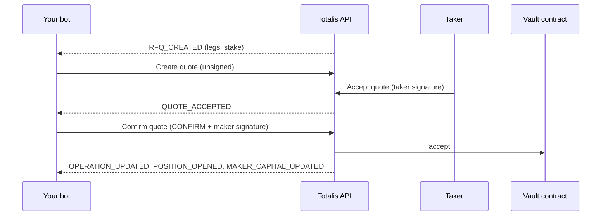

As a maker you price the RFQs takers create. You create unsigned quotes. When a taker accepts one, you
receive `QUOTE_ACCEPTED` and confirm it with your quote signer's signature before a short deadline, or
decline it. The vault contract then takes the taker's stake into your maker vault and holds what you owe
if the position wins.



## The flow

| Step | Raw API | SDK |
| --- | --- | --- |
| Fund capital | Controller transactions to the vault contract; read [Get maker capital](/hyperliquid/api-reference/makers/get-maker-capital) | `maker.controller()` |
| Subscribe | [Open stream](/hyperliquid/api-reference/streams/open-stream) with a `maker` subscription | `maker.onRfq(handler)` |
| Quote | [Create quote](/hyperliquid/api-reference/quotes/create-quote) | `maker.quote(rfq, { payout })`, `maker.bid(rfq, { price })` |
| Cancel | [Cancel quote](/hyperliquid/api-reference/quotes/cancel-quote) | `maker.cancelQuote(quoteId)` |
| Confirm | [Confirm quote](/hyperliquid/api-reference/quotes/confirm-quote) on each `QUOTE_ACCEPTED` | `maker.onAcceptance(handler)` |
| Collateral | [Create collateral reduction](/hyperliquid/api-reference/makers/create-collateral-reduction) | `maker.reduceCollateral()` |

## Roles and keys

| Term | What it is |
| --- | --- |
| **Maker** | Your market-making identity on the vault contract, named by `maker_id`. |
| **Controller** (`owner`) | The Totalis account wallet that created the maker. It approves maker keys, and it is the only wallet that can withdraw maker funds or change the quote signer. |
| **Quote signer** (`signer`) | A key your bot holds. It signs every quote your bot confirms. It holds no funds and cannot withdraw, and the controller can replace it at any time. |
| **Maker vault** | Your maker's USDC inside the vault contract. It backs every quote you confirm. |
| **Maker key** | A `ttk_` key bound to your maker. It authenticates your bot's calls. |

Keep the quote signer separate from the controller. If the bot host is compromised, the attacker can
sign quotes but cannot withdraw your capital.

## Set up and fund your capital

1. Generate a fresh key pair for your bot's quote signer and note its address.
2. Sign in at [totalis-hip4.vercel.app/mm](https://totalis-hip4.vercel.app/mm) and choose **Start market making**.
3. Enter the quote signer address as **Bot quote signer address** and choose **Create maker account**.
   Your account wallet sends the HyperEVM transaction that opens your maker vault, so it needs HYPE for
   gas.
4. Fund the maker vault from the maker dashboard, or from code with [controller transactions](#move-maker-funds).
   Only funded capital backs quotes.

Then create a maker key: in the app, go to
[Account, then API keys](https://totalis-hip4.vercel.app/account/api-keys), choose **Maker account**,
and select the maker scopes from
[Recommended scope sets](/hyperliquid/authentication#recommended-scope-sets). The controller approves
the key with a signature. The key is shown once.

Read your capital to check the maker is ready:

<CodeGroup>
```ts SDK
import { createMakerClient } from "@totalistrading/hip4-client/maker";
import { unwrap } from "@totalistrading/hip4-client";

const client = createMakerClient("production", { accessToken: process.env.TOTALIS_MAKER_KEY });
const capital = unwrap(await client.GET("/v1/makers/{maker_id}/capital", {
  params: { path: { maker_id: process.env.TOTALIS_MAKER_ID! } },
}));
console.log(capital.signer, capital.free_collateral); // your quote signer, and the headroom for new fills
```

```bash curl
curl https://hip4-api.totalis.trade/v1/makers/$TOTALIS_MAKER_ID/capital \
  -H "Authorization: Bearer $TOTALIS_MAKER_KEY"
```
</CodeGroup>

`free_collateral` is the headroom that backs new fills. A confirm fails when your vault cannot cover
it, so read capital again on every `MAKER_CAPITAL_UPDATED` event.

## Subscribe

```ts
import { createMaker, type MakerAcceptance } from "@totalistrading/hip4-client/maker";
import { privateKeyToAccount } from "viem/accounts";

const maker = createMaker({
  environment: "production",
  apiKey: process.env.TOTALIS_MAKER_KEY!,
  makerId: process.env.TOTALIS_MAKER_ID!,
  signer: privateKeyToAccount(process.env.QUOTE_SIGNER_KEY as `0x${string}`),
});

maker.stream.on("status", (status) => console.log(`stream ${status}`));

maker.onRfq(async (rfq) => {
  if (rfq.kind === "ENTRY") {
    const payout = (BigInt(rfq.stake) * 18n) / 10n; // placeholder: price from your own market data
    const { quoteId } = await maker.quote(rfq, { payout });
    console.log(`quoted ${rfq.rfq_id} ${quoteId}`);
  } else {
    const { quoteId } = await maker.bid(rfq, { price: 18_000_000n }); // placeholder
    console.log(`quoted cash-out of ${rfq.position_id} ${quoteId}`);
  }
}, (error) => console.error("rfq handling failed", error));

maker.onAcceptance((acceptance) => (stillWilling(acceptance) ? "CONFIRM" : "DECLINE"),
  (error, acceptance) => console.error(`confirm of ${acceptance?.quote_id} failed`, error));

process.once("SIGINT", () => maker.close());

// Your last check before signing: prices still hold and the vault can cover the fill.
function stillWilling(acceptance: MakerAcceptance): boolean {
  return Date.parse(acceptance.deadline) > Date.now(); // placeholder: re-check prices and headroom
}
```

`createMaker` opens a [maker subscription](/hyperliquid/maker-stream). `onRfq` calls your handler once
for every open RFQ: from `RFQ_CREATED` events and from the snapshot's `open_rfqs`. Each `RFQ_CREATED`
carries the whole RFQ, so a live one needs no read. After a snapshot that truncated `open_rfqs`, the SDK
pages [List RFQs](/hyperliquid/api-reference/rfqs/list-rfqs) for you. If the handler throws, the RFQ can
be delivered again.

<Note>
The Totalis stream carries RFQs and lifecycle events, not prices. Price each leg from your own
Hyperliquid market data, such as Hyperliquid's public
[info API and WebSocket](https://hyperliquid.gitbook.io/hyperliquid-docs/for-developers/api).
</Note>

## Quote

A quote needs no signature when you create it. A new quote replaces your previous one on the same RFQ.

### Entry quotes

`maker.quote(rfq, { payout })` builds the `entry` terms from the RFQ, computes their EIP-712 digest as
the `quote_id`, and sends [Create quote](/hyperliquid/api-reference/quotes/create-quote).

| Field | Set by | Rule |
| --- | --- | --- |
| `legs`, `stake`, `taker` | The RFQ | Copied exactly. Legs in ascending `outcome_id` order. |
| `payout` | You | What you pay if every leg wins. |
| `fee_bps`, `taker_fee_bps` | The deployment | Read from [Get deployment](/hyperliquid/api-reference/deployment/get-deployment) for every quote. A quote with other values is rejected. |
| `expiry` | `lifetimeSeconds` (default 20) | Unix seconds. The allowed range is on [Limits](/hyperliquid/limits). |
| `salt` | Random | A random uint256 that makes every `quote_id` unique. |

The `quote_id` of an entry quote is also the `position_id` of the position it opens if accepted.

### Cash-out quotes

A cash-out `RFQ_CREATED` means an owner wants to sell a position. It carries the position's `legs`,
`owner`, the `maker_id` that backs it, and a `leg_state` read at `decision_block`. Price from that
block. `maker.bid(rfq, { price })` creates the quote:

| Your maker | `bid` creates | On confirm |
| --- | --- | --- |
| Backs the position | `sell_back` terms | The vault buys the position back from your maker vault, and it closes. |
| Does not | `transfer` terms | Your quote signer buys the position and pays the owner, so it must hold enough USDC in the vault. |

Cash-out quotes default to a 45 second life. The owner signs your quote before accepting it, so your
confirm executes the sale.

### Without the SDK

Send `quote_id` plus exactly one of `entry`, `sell_back` or `transfer`, with an `Idempotency-Key`.
`quote_id` is `hashTypedData` of `quoteTypedData`, `sellBackTypedData` or `cashoutTransferTypedData`
over those terms (see [Signing](/hyperliquid/signing)).

```bash
curl https://hip4-api.totalis.trade/v1/rfqs/$RFQ_ID/quotes \
  -H "Authorization: Bearer $TOTALIS_MAKER_KEY" \
  -H "Idempotency-Key: 01a0df4e-5f11-7a2b-9c3d-4e5f6a7b8c9d" \
  -H "Content-Type: application/json" \
  -d '{
    "quote_id": "0x5e5e...5e5e",
    "entry": {
      "maker_id": "7",
      "legs": [{ "outcome_id": "1209", "side": "YES" }],
      "stake": "25000000",
      "payout": "98500000",
      "fee_bps": 100,
      "taker_fee_bps": 20,
      "taker": "0x1111111111111111111111111111111111111111",
      "expiry": "1790452875",
      "salt": "48151623429108"
    }
  }'
```

The response is `201` with `quote_id`. The taker sees it as `QUOTE_CREATED`.

## Cancel

<CodeGroup>
```ts SDK
const { status } = await maker.cancelQuote(quoteId);
```

```bash curl
curl -X DELETE https://hip4-api.totalis.trade/v1/quotes/$QUOTE_ID \
  -H "Authorization: Bearer $TOTALIS_MAKER_KEY"
```
</CodeGroup>

| `status` | Meaning |
| --- | --- |
| `CANCELLED` | The quote is off the RFQ, now or earlier. |
| `REPLACED` | A newer quote of yours already replaced it. |
| `ACCEPTED` (HTTP `409`) | A confirm already accepted it for a taker. It cannot be cancelled. |

Cancelling is idempotent and needs no `Idempotency-Key`. A confirmed signature can still execute after
a cancel, so keep that risk until the operation is terminal.

## Confirm

When a taker accepts your quote, the venue sends `QUOTE_ACCEPTED` with the exact terms and a `deadline`
(see [Limits](/hyperliquid/limits)). The taker has already signed. `onAcceptance` calls your handler once
per acceptance, from the event (live, or replayed after a reconnect) and from the snapshot's
`acceptances`. When the snapshot truncated them, the SDK pages
[List acceptances](/hyperliquid/api-reference/quotes/list-acceptances). Return `"CONFIRM"` or `"DECLINE"`.

```json
{
  "quote_id": "0x2b7c9d1e3f4a5b6c7d8e9f0a1b2c3d4e5f6a7b8c9d0e1f2a3b4c5d6e7f8a9b0c",
  "rfq_id": "0199a1c9-0a11-7c3e-9f20-5b7d8e9fa001",
  "kind": "ENTRY",
  "deadline": "2026-09-26T20:00:08.101Z",
  "entry": {
    "maker_id": "3",
    "legs": [{ "outcome_id": "1209", "side": "YES" }],
    "stake": "25000000",
    "payout": "61000000",
    "fee_bps": 500,
    "taker_fee_bps": 20,
    "taker": "0x1111111111111111111111111111111111111111",
    "expiry": "1790193625",
    "salt": "73100245913027741890236401853207113049"
  }
}
```

On `CONFIRM` the SDK checks the terms against their `quote_id`, checks that this maker created them and
they have not expired, signs them with the quote signer, and sends
[Confirm quote](/hyperliquid/api-reference/quotes/confirm-quote). It never signs terms it did not
create. Each acceptance is decided and signed once, and a lost answer is resent byte for byte.

Without the SDK, answer on the quote. The quote has at most one acceptance, so it keys the answer and
the route takes no `Idempotency-Key`: sending one returns `INVALID_IDEMPOTENCY_KEY`. The same answer
replays; a different one returns `IDEMPOTENCY_KEY_REUSED`.

```bash
curl https://hip4-api.totalis.trade/v1/quotes/$QUOTE_ID/confirm \
  -H "Authorization: Bearer $TOTALIS_MAKER_KEY" \
  -H "Content-Type: application/json" \
  -d '{ "decision": "CONFIRM", "maker_signature": "0xcdcd...cd1c" }'
```

Sign `entry` terms as `Quote`, `sell_back` as `SellBack` and `transfer` as `CashoutTransfer`.
`{ "decision": "DECLINE" }` needs no signature.

| Result `status` | Meaning |
| --- | --- |
| `ACCEPTED` | Your confirm was accepted and the fill, sell-back or transfer is queued as `operation_id`. |
| `PENDING_FUNDING` | An entry the taker funds from HyperCore: the fill waits for that payment, then becomes `ACCEPTED`, or `CANCELLED` if it never lands. Keep the risk reserved until then. |
| `DECLINED` | You declined. Nothing was filled. |
| `TIMED_OUT` | You missed the deadline. Nothing was filled. |
| `CANCELLED` | The quote or RFQ stopped being available first. Nothing was filled. |

Keep the handler fast: re-check prices and headroom, then answer. Do pricing work in `onRfq`, never in
the confirm path.

## Resume after a restart

Persist the stream cursor as you apply events, and pass it back when you start. The stream replays the
retained events after it, or resets to a fresh snapshot when the cursor is too old (see
[Connect and resume](/hyperliquid/streams#resume)). Either way `onRfq` and `onAcceptance` see every open
RFQ and pending acceptance. Resuming needs `replay:read`.

```ts
import { createMaker, type PublishedStore } from "@totalistrading/hip4-client/maker";
import type { RealtimeCursor } from "@totalistrading/hip4-client/realtime";

declare const saved: RealtimeCursor | undefined; // loaded from your storage
declare function save(cursor: RealtimeCursor): void;
declare const published: PublishedStore; // backed by your database

const maker = createMaker({
  environment: "production",
  apiKey: process.env.TOTALIS_MAKER_KEY!,
  makerId: process.env.TOTALIS_MAKER_ID!,
  signer: privateKeyToAccount(process.env.QUOTE_SIGNER_KEY as `0x${string}`),
  published,
  stream: saved === undefined ? {} : { cursor: saved },
});
maker.stream.on("event", () => save(maker.stream.cursor!));
```

`published` records the `quote_id`s this maker creates, the only terms its quote signer will sign. The
default keeps them in memory. Back it with durable storage (`record`, `forget` and `expiry`) so a
restarted or separate confirming process can answer quotes created before.

## Monitor capital and positions

| Read | Returns |
| --- | --- |
| [Get maker capital](/hyperliquid/api-reference/makers/get-maker-capital) | `owner`, `signer`, and the vault lanes: `vault_gross`, `stake_escrow`, `payable_owed`, `gross_open`, `requirement` and `free_collateral`. `deployment_digest` names the deployment the read is bound to. |
| [List positions](/hyperliquid/api-reference/positions/list-positions) | The positions your maker wrote, open and settled |
| [List activity](/hyperliquid/api-reference/account/list-activity) | Your maker's fills, settlements and vault movements |
| [List operations](/hyperliquid/api-reference/account/list-operations) | Your maker's on-chain operations |

Each needs `vault:read`. With a maker key, the `/v1/me/...` reads return your maker's state, never a
personal account's. Every amount is an atomic USDC string, or `null` when it cannot be established, and
each response carries one `context` with `as_of` and a `status` of `CURRENT`, `STALE` or `UNAVAILABLE`.

## Move maker funds

Maker vault transactions are sent by the controller wallet, directly to the vault contract. Totalis does
not relay or sponsor them. `maker.controller()` builds each one as `{ chain_id, to, data, value }` for
your wallet to sign and send. The controller pays the gas in HYPE. To send from code, export its key as
described in [Export your wallet key](/hyperliquid/authentication#export-your-wallet-key).

```ts
import { createWalletClient, defineChain, http } from "viem";

const hyperEvm = defineChain({
  id: 999, name: "HyperEVM", nativeCurrency: { name: "HYPE", symbol: "HYPE", decimals: 18 },
  rpcUrls: { default: { http: ["https://rpc.hyperliquid.xyz/evm"] } },
});
const controller = createWalletClient({
  account: privateKeyToAccount(process.env.CONTROLLER_KEY as `0x${string}`),
  chain: hyperEvm,
  transport: http(),
});
const send = ({ to, data }: { to: `0x${string}`; data: `0x${string}` }) => controller.sendTransaction({ to, data });

const tx = await maker.controller();
await send(tx.approveUsdc(1_000_000_000n)); // 1,000 USDC
await send(tx.deposit(1_000_000_000n));     // depositMaker
await send(tx.requestWithdraw(250_000_000n, controller.account.address)); // starts the withdrawal delay
```

| Builder | Vault call | Notes |
| --- | --- | --- |
| `approveUsdc(amount)` | USDC `approve(vault, amount)` | Sent before `deposit` by the wallet that funds it. |
| `deposit(amount)` | `depositMaker` | Pulls the approved USDC into your maker vault. |
| `requestWithdraw(amount, to)` | `requestMakerWithdraw` | Starts the maker withdrawal delay on [Limits](/hyperliquid/limits). |
| `executeWithdraw()` | `executeMakerWithdraw` | Pays out the pending request once the delay has passed. |
| `cancelWithdraw()` | `cancelMakerWithdraw` | Cancels a pending request. |
| `setQuoteSigner(signer)` | `setQuoteSigner` | Takes effect at once. The zero address stops all fills. |
| `resetDiscount()` | `resetDiscount` | Sets your collateral discount back to zero, which raises your requirement. |

The effects arrive as `MAKER_CAPITAL_UPDATED` events and in your capital read.

## Reduce collateral

A collateral reduction lowers your requirement against correlated open positions.
`maker.reduceCollateral` creates the job, follows it on the stream (`COLLATERAL_REDUCTION_UPDATED`), and,
when the attestation is ready, has your gas wallet sign it as a raw transaction and relays it with
[Submit self-funded transaction](/hyperliquid/api-reference/makers/submit-self-funded-transaction). Your
maker pays the gas in HYPE. It needs `vault:write` and `operations:submit`.

```ts
// Any wallet with HYPE can pay for the attestation; it carries no authority.
const gasWallet = createWalletClient({
  account: privateKeyToAccount(process.env.GAS_WALLET_KEY as `0x${string}`),
  chain: hyperEvm,
  transport: http(),
});

const { job, submitted } = await maker.reduceCollateral({
  signTransaction: async ({ to, data }) =>
    gasWallet.signTransaction(await gasWallet.prepareTransactionRequest({ to, data, type: "eip1559" })),
});
console.log(job.status, submitted?.operation_id); // NO_IMPROVEMENT, FAILED, or DURABLE with the attestation relayed
```

A job stays `QUEUED` until its `next_eligible_at`. Without `signTransaction`, the call resolves with the
job and its `transaction`. The vault call is permissionless, so you may also broadcast it yourself.

## Errors to handle

| Code | Cause | Do |
| --- | --- | --- |
| `FORBIDDEN` | The key lacks a scope. | Check the key's scopes. |
| `NOT_FOUND` | The path names a maker other than the key's. | Use your own `maker_id`. |
| `WRONG_AUTHORITY` | The signature is not from your current quote signer. | Sign with `signer` from your capital read. |
| `INVALID_SIGNATURE` | The signature does not verify for the accepted terms. | Sign the exact terms in `QUOTE_ACCEPTED`. |
| `RFQ_NOT_OPEN`, `QUOTE_EXPIRED` | The RFQ or quote ran out of time. | Drop it. |
| `QUOTE_SIGNER_CHANGED` | The quote signer changed after you created the quote. | Restart the bot with the new quote signer, then quote again. |
| `QUOTE_CAPACITY_EXCEEDED` | Your capital no longer covers the quote. | Add capital or reduce collateral. |
| `QUOTE_EXPOSURE_LIMIT` | Your open quote exposure is at its limit. | Cancel quotes, or wait, then retry. |
| `RATE_LIMITED` | Over quota. | Honor `Retry-After`. The SDK does. |
| `FINANCIAL_ACTIONS_DISABLED` | Trading is paused. | Stop quoting until it clears. |

If a confirm response is lost, resend the same answer. Until you know the outcome, treat the quote as
filled risk. Every code is on [Errors](/hyperliquid/errors).
