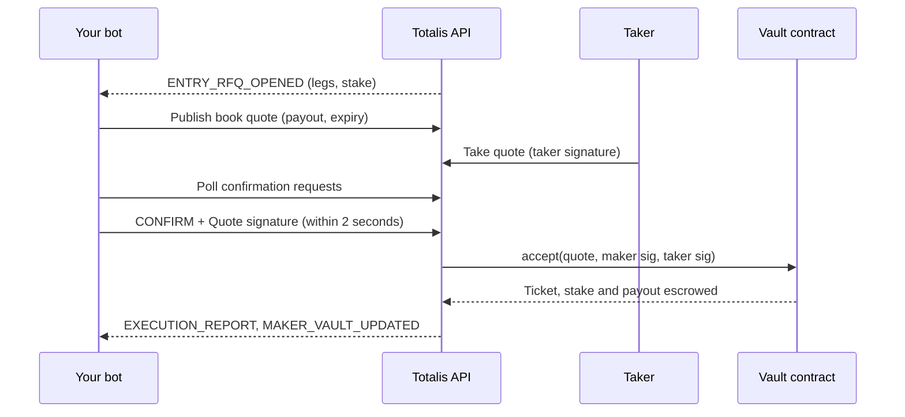

As a market maker you price RFQs for singles and parlays on Hyperliquid HIP-4 outcomes. Takers see
your quotes, and when one takes yours you have 2 seconds to confirm it with a signature. The vault
contract then pays the taker's stake into your maker vault and escrows the payout you owe if the
ticket wins.



## Roles and keys

| Term | What it is |
| --- | --- |
| **Maker** | Your market-making identity on the vault contract, identified by `maker_id`. One per Totalis account. |
| **Controller** | The Totalis account wallet that owns the maker. It approves maker API keys and is the only wallet that can withdraw maker funds or change the quote signer. |
| **Quote signer** | A key your bot holds. It signs every quote your bot confirms. It never holds funds, and you can rotate it. |
| **Maker vault** | Your maker's USDC inside the vault contract. It backs every quote you confirm. |
| **Maker API key** | Authenticates your bot's calls. Created by the controller in the app. |

Keep the quote signer separate from the controller. If the bot host is compromised, the attacker can
sign quotes but cannot withdraw your capital.

## 1. Set up your maker in the app

1. Generate a fresh key pair for your bot's quote signer and note its address.
2. Sign in at [app.totalis.trade/mm](https://app.totalis.trade/mm) and choose **Start market making**.
3. Enter the quote signer address when asked. The app creates your maker vault on-chain from your
   account wallet, then asks you to authorize quoting. Your maker is active when the dashboard opens.
4. Fund the vault from the maker dashboard. Only funded capital backs quotes.

Check the maker's status at any time with
[Get maker registration](/hyperliquid/api-reference/maker-access/get-maker-registration). `status`
must be `ACTIVE` before quotes are accepted.

## 2. Create a maker API key

In the app, go to [Account, then API keys](https://app.totalis.trade/account/api-keys), switch to
**Maker account**, and create a key. Choose the market maker scopes: `rfq:read`, `quote:read`,
`quote:write`, `replay:read`, and `vault:read`. The controller wallet approves the key with a
signature in the app. See [Authentication](/hyperliquid/authentication#maker-scopes) for what each
scope grants.

The key is shown once. Store it next to the quote signer key in your bot's secret store.

## 3. Read your vault

```bash
curl https://hip4-api.totalis.trade/v1/maker-vaults/$MAKER_ID \
  -H "Authorization: Bearer $TOTALIS_HL_MAKER_KEY"
```

The response wraps the vault in `maker_vault`:

| Field | Meaning |
| --- | --- |
| `vault_amount` | USDC in your maker vault. |
| `stake_escrow_amount` | Taker stakes held against your open tickets. |
| `payable_owed_amount` | Payouts you owe on settled tickets that are not yet claimed. |
| `gross_open_amount` | Total payout you would owe if every open ticket won. |
| `discount_amount` | Collateral relief granted from a [collateral reduction](/hyperliquid/api-reference/funds-and-tickets/create-collateral-reduction). |
| `quote_signer` | The address whose signatures the contract accepts for your quotes. |

A fill is rejected on-chain when your vault cannot cover it. Watch `MAKER_VAULT_UPDATED` events
(step 4) to keep headroom current. To add funds outside the app,
[Get maker vault funding transaction](/hyperliquid/api-reference/account/get-maker-vault-funding-transaction)
returns a ready-to-send transaction for your wallet. You approve USDC and pay gas yourself.

## 4. Stream RFQs

Open a WebSocket to `wss://hip4-api.totalis.trade/v1/stream` with your key in the `Authorization`
header, then send a hello for the `MAKER` topic:

```json
{
  "type": "session.hello",
  "schema_version": 1,
  "client_instance_id": "8f6d2c1e-6a1b-4f5e-9d7e-2b1f0c9a4e11",
  "subscriptions": [{ "topic": "MAKER" }],
  "rfq_details": true
}
```

The server answers with `session.ready`, a `stream.snapshot` of current state, and then
`stream.event` frames. With `rfq_details: true`, an `ENTRY_RFQ_OPENED` frame also carries the open RFQ
in `rfq`. If `rfq` is missing, read it with [Get RFQ](/hyperliquid/api-reference/rfqs-and-quotes/get-rfq).
A `CASHOUT_RFQ_OPENED` event carries the ticket, owner, legs, and `leg_state` in `event.payload`.

```json
{
  "type": "stream.event",
  "event": {
    "event_type": "ENTRY_RFQ_OPENED",
    "resource_id": "0199...",
    "stream": { "stream_id": "...", "generation_id": "...", "sequence": "77" }
  },
  "rfq": {
    "rfq_id": "0199...",
    "kind": "ENTRY",
    "taker_address": "0x...",
    "stake_amount": "25000000",
    "state": "OPEN",
    "expires_at": "2026-09-24T12:00:20Z",
    "legs": [{ "outcome_id": 1209, "side": 0 }, { "outcome_id": 1473, "side": 1 }]
  }
}
```

| Event | Do |
| --- | --- |
| `ENTRY_RFQ_OPENED` | Price it and publish a quote (step 5). |
| `CASHOUT_RFQ_OPENED` | Bid to buy back a ticket (step 7). |
| `RFQ_CANCELLED`, `RFQ_CLOSED` | Stop quoting that RFQ. |
| `EXECUTION_REPORT` | A fill you confirmed finished on-chain. |
| `MAKER_VAULT_UPDATED` | Your vault balances changed. Recompute headroom. |

`side` is `0` for YES and `1` for NO.

### Staying in sync

Persist the `stream` cursor from the last event you applied. On reconnect, send it in the
subscription as `"cursor": { "stream_id", "generation_id", "sequence" }` (requires `replay:read`).
`session.ready` then tells you how the server resumed:

| `resume` | Do |
| --- | --- |
| `REPLAY` | Missed events follow. Apply them in order. |
| `SNAPSHOT`, `RESET` | Replace your local state with the snapshot that follows. |

The server sends a heartbeat on the interval given in `session.ready` and closes the socket after two
missed heartbeats. It also asks you to reconnect periodically with `connection.drain`. Reconnect with
exponential backoff from 1 second up to 10 seconds. Without a socket,
[Get maker snapshot](/hyperliquid/api-reference/realtime/get-maker-snapshot) and
[List maker events](/hyperliquid/api-reference/realtime/list-maker-events) give the same data over
HTTP, and a `409 CURSOR_RESET` from events means take a fresh snapshot.

## 5. Publish a quote

A quote is the exact terms you are willing to fill. Build it from the RFQ, compute its EIP-712 digest,
and publish it to the RFQ's book. Publishing does not need a signature. You sign only when a taker
takes it (step 6).

<Note>
The Totalis stream carries RFQs and lifecycle events, not prices. Price each leg from your own
Hyperliquid market data, such as Hyperliquid's public
[info API and WebSocket](https://hyperliquid.gitbook.io/hyperliquid-docs/for-developers/api).
</Note>

```ts
import { hashTypedData } from "viem";
import { v7 as uuidv7 } from "uuid";

const vault = await get("/v1/vault"); // chain_id and vault_address for the domain
const domain = {
  name: "TotalisParlay",
  version: "1",
  chainId: Number(vault.chain_id),
  verifyingContract: vault.vault_address,
};
const types = {
  Quote: [
    { name: "makerId", type: "uint64" },
    { name: "legs", type: "Leg[]" },
    { name: "stake", type: "uint128" },
    { name: "payout", type: "uint128" },
    { name: "feeBps", type: "uint16" },
    { name: "takerFeeBps", type: "uint16" },
    { name: "taker", type: "address" },
    { name: "expiry", type: "uint64" },
    { name: "salt", type: "uint256" },
  ],
  Leg: [
    { name: "outcomeId", type: "uint32" },
    { name: "side", type: "uint8" },
  ],
} as const;

// The API quote as the EIP-712 message. Confirmation signs this same message.
function toMessage(quote: any) {
  return {
    makerId: BigInt(quote.maker_id),
    legs: quote.legs.map((l: any) => ({ outcomeId: l.outcome_id, side: l.side })),
    stake: BigInt(quote.stake),
    payout: BigInt(quote.payout),
    feeBps: quote.fee_bps,
    takerFeeBps: quote.taker_fee_bps,
    taker: quote.taker,
    expiry: BigInt(quote.expiry),
    salt: BigInt(quote.salt),
  };
}

function buildQuote(rfq: any, payout: bigint, feeBps: number, takerFeeBps: number) {
  const salt = BigInt("0x" + crypto.getRandomValues(new Uint8Array(32)).reduce((s, b) => s + b.toString(16).padStart(2, "0"), ""));
  const quote = {
    maker_id: MAKER_ID,
    legs: rfq.legs,
    stake: rfq.stake_amount,
    payout: payout.toString(),
    fee_bps: feeBps,
    taker_fee_bps: takerFeeBps,
    taker: rfq.taker_address,
    expiry: String(Math.floor(Date.now() / 1000) + 20),
    salt: salt.toString(),
  };
  return { quote, digest: hashTypedData({ domain, types, primaryType: "Quote", message: toMessage(quote) }) };
}

const { quote, digest } = buildQuote(rfq, 61_000_000n, 100, 20);
await command(`/v1/rfqs/${rfq.rfq_id}/book-quotes`, { quote_digest: digest, quote });
```

| Field | Rule |
| --- | --- |
| `legs`, `stake`, `taker` | Copied exactly from the RFQ. Legs stay in the RFQ's order. |
| `payout` | What you pay if every leg wins. At least the net stake. |
| `fee_bps`, `taker_fee_bps` | Must equal the vault's current fees. A mismatch reverts on-chain. |
| `expiry` | Unix seconds. See [Limits and timing](/hyperliquid/conventions#limits-and-timing). |
| `salt` | A random uint256. It makes every quote digest unique. |

The `command` helper is the same one as in the [trading walkthrough](/hyperliquid/trading#1-set-up-a-client),
using your maker key. Publishing the same RFQ again replaces your previous quote on it. To pull a
quote, call [Withdraw book quote](/hyperliquid/api-reference/rfqs-and-quotes/withdraw-book-quote).

## 6. Confirm fills within 2 seconds

When a taker takes your quote, or a ticket owner takes your cashout bid, the venue opens a
confirmation request and gives you 2 seconds. An entry request carries the `quote` you published. A
cashout request carries your `sell_back` or `transfer` bid instead (step 7). Poll for requests
continuously and sign the terms each one carries:

```ts
import { privateKeyToAccount } from "viem/accounts";

const quoteSigner = privateKeyToAccount(process.env.TOTALIS_QUOTE_SIGNER_KEY as `0x${string}`);
const bidFields = [
  { name: "ticketId", type: "bytes32" },
  { name: "price", type: "uint128" },
] as const;
const tail = [
  { name: "expiry", type: "uint64" },
  { name: "salt", type: "uint256" },
  { name: "legState", type: "bytes32" },
] as const;

async function signConfirmation(c: any) {
  if (c.quote) {
    return quoteSigner.signTypedData({ domain, types, primaryType: "Quote", message: toMessage(c.quote) });
  }
  const bid = c.sell_back ?? c.transfer;
  const common = {
    ticketId: bid.ticket_id,
    price: BigInt(bid.price),
    expiry: BigInt(bid.expiry),
    salt: BigInt(bid.salt),
    legState: bid.leg_state,
  };
  if (c.sell_back) {
    return quoteSigner.signTypedData({
      domain,
      types: { SellBack: [...bidFields, { name: "owner", type: "address" }, ...tail] },
      primaryType: "SellBack",
      message: { ...common, owner: bid.owner },
    });
  }
  return quoteSigner.signTypedData({
    domain,
    types: {
      CashoutTransfer: [...bidFields, { name: "seller", type: "address" }, { name: "buyer", type: "address" }, ...tail],
    },
    primaryType: "CashoutTransfer",
    message: { ...common, seller: bid.seller, buyer: bid.buyer },
  });
}

const { confirmations } = await get("/v1/maker/confirmations");
for (const c of confirmations) {
  const ok = stillWantThisRisk(c); // your own check of prices and vault headroom
  const body = ok ? { decision: "CONFIRM", maker_signature: await signConfirmation(c) } : { decision: "DECLINE" };
  await command(`/v1/rfqs/${c.rfq_id}/attempts/${c.attempt_id}/confirmation`, body, c.attempt_id);
}
```

- Sign the terms in the request, which are the terms you published. `domain`, `types`, and `toMessage`
  are from step 5.
- `quoteSigner` holds your quote signer key. The contract rejects any other signer.
- The `Idempotency-Key` must equal `attempt_id`.

| Result `state` | Meaning |
| --- | --- |
| `COMMITTED` | Entry: your confirmation was accepted and the fill is queued on-chain. |
| `CONFIRMED` | Cashout: your signature was accepted. Nothing executes until the ticket owner countersigns, so keep the risk reserved until the cashout RFQ closes. |
| `DECLINED` | You declined. The taker can take another quote. |
| `TIMED_OUT` | You missed the 2 second deadline. Nothing was filled. |

Run confirmation polling on its own worker so a slow pricing loop never makes you miss the deadline.
The polling rate limit is on [Limits and timing](/hyperliquid/conventions#rate-limits).

## 7. Bid on cashouts

A `CASHOUT_RFQ_OPENED` event means a ticket owner wants to sell a ticket before it resolves. The event
carries the ticket's legs and a `leg_state` snapshot. Publish a bid with
[Publish cashout book quote](/hyperliquid/api-reference/rfqs-and-quotes/publish-cashout-book-quote):

```json
{
  "bid_digest": "0x...",
  "sell_back": {
    "ticket_id": "0x...",
    "price": "18000000",
    "owner": "0x...",
    "expiry": "1790251260",
    "salt": "5521...",
    "leg_state": "0x..."
  }
}
```

`bid_digest` is the EIP-712 digest of
`SellBack(bytes32 ticketId,uint128 price,address owner,uint64 expiry,uint256 salt,bytes32 legState)`
on the same domain. Buying the ticket for your own book instead uses a `transfer` bid, whose
`bid_digest` is the `CashoutTransfer` digest. When the owner takes your bid, the step 6 loop confirms
it with the matching signature.

## 8. Monitor positions and performance

| Read | Scope and maker permission | Returns |
| --- | --- | --- |
| [List maker positions](/hyperliquid/api-reference/maker-reads/list-maker-positions) | `vault:read`, `READ_POSITIONS` | Open and settled tickets against your maker. |
| [List maker activity](/hyperliquid/api-reference/maker-reads/list-maker-activity) | `vault:read`, `READ_ACTIVITY` | Fills, settlements, and vault movements. |
| [Get maker performance](/hyperliquid/api-reference/maker-reads/get-maker-performance) | `vault:read`, `READ_PERFORMANCE` | P&L and volume between `from` and `through`. |
| [List maker quotes](/hyperliquid/api-reference/realtime/list-maker-quotes) | `quote:read` | Your live quotes. |

The position, activity, and performance reads require the `X-Totalis-Account-Contract: 1` header
plus the `chain_id` and `vault` query parameters from
[Get vault release](/hyperliquid/api-reference/vault/get-vault-release).

## Withdrawing capital and rotating the signer

Maker withdrawals and quote signer changes are signed by the controller wallet. Call the vault
contract directly, or send a controller-signed action to
[Submit maker vault action](/hyperliquid/api-reference/funds-and-tickets/submit-maker-vault-action)
(scope `vault:write`), which returns the transaction for your wallet to send:

| Action | Contract call | Notes |
| --- | --- | --- |
| Withdraw | `requestMakerWithdraw`, then `executeMakerWithdraw` | Execution waits out the maker withdrawal delay on [Limits and timing](/hyperliquid/conventions#limits-and-timing). `cancelMakerWithdraw` cancels a pending request. |
| Rotate the quote signer | `setQuoteSigner` | Setting it to the zero address stops all fills immediately. |

## Errors to handle

| Response | Cause | Do |
| --- | --- | --- |
| `403 FORBIDDEN` | The key lacks a scope, or `quote.maker_id` is not the key's maker. | Check the key's scopes and maker. |
| `403 WRONG_AUTHORITY` | The signature is not from your current `quote_signer`. | Sign with the quote signer on your vault. |
| `409 QUOTE_EXPIRED`, `RFQ_NOT_OPEN` | The RFQ or quote ran out of time. | Drop it. |
| `429 RATE_LIMITED` | Over quota. | Honor `Retry-After`. |
| `503 FINANCIAL_ACTIONS_DISABLED` | Trading is paused. | Stop quoting until it clears. |

If a confirmation response is lost, resend it with the same `attempt_id`. Until you know the outcome,
treat the quote as filled risk.
