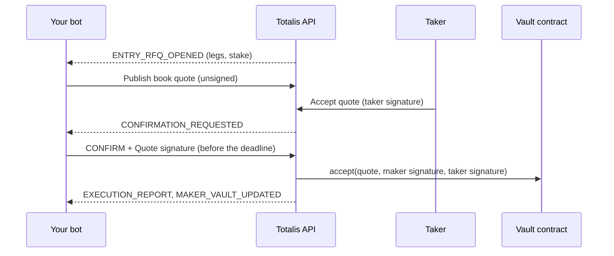

As a market maker you price RFQs for singles and parlays on Hyperliquid HIP-4 outcomes. You publish
unsigned quotes. When a taker selects yours, you get a confirmation request and a short deadline to
sign it. The vault contract then pays the taker's stake into your maker vault and escrows the payout
you owe if the ticket wins.


```mermaid
sequenceDiagram
  participant Bot as Your bot
  participant API as Totalis API
  participant Taker
  participant Vault as Vault contract
  API-->>Bot: ENTRY_RFQ_OPENED (legs, stake)
  Bot->>API: Publish book quote (unsigned)
  Taker->>API: Accept quote (taker signature)
  API-->>Bot: CONFIRMATION_REQUESTED
  Bot->>API: CONFIRM + Quote signature (before the deadline)
  API->>Vault: accept(quote, maker signature, taker signature)
  API-->>Bot: EXECUTION_REPORT, MAKER_VAULT_UPDATED
```

## Roles and keys

| Term | What it is |
| --- | --- |
| **Maker** | Your market-making identity on the vault contract, identified by `maker_id`. |
| **Controller** (`owner`) | The Totalis account wallet that created the maker. It approves maker keys and is the only wallet that can withdraw maker funds or change the quote signer. |
| **Quote signer** (`signer`) | A key your bot holds. It signs every quote and bid your bot confirms. It holds no funds and cannot withdraw, and the controller can replace it at any time. |
| **Maker vault** | Your maker's USDC inside the vault contract. It backs every quote you confirm. |
| **Maker key** | A `ttk_` key bound to your maker. It authenticates your bot's calls. |

Keep the quote signer separate from the controller. If the bot host is compromised, the attacker can
sign quotes but cannot withdraw your capital.

## 1. Set up your maker in the app

1. Generate a fresh key pair for your bot's quote signer and note its address.
2. Sign in at [totalis-hip4.vercel.app/mm](https://totalis-hip4.vercel.app/mm) and choose **Start market making**.
3. Enter the quote signer address as **Bot quote signer address** and choose **Create maker account**.
   Your account wallet sends the HyperEVM transaction that opens your maker vault, so it needs HYPE
   for gas. The app then finishes setup.
4. Fund the vault from the maker dashboard. Only funded capital backs quotes.

The maker dashboard in the app shows your maker's status. It must be active before quotes are
accepted.

## 2. Create a maker key

In the app, go to [Account, then API keys](https://totalis-hip4.vercel.app/account/api-keys), choose
**Maker account** under **Manage keys for**, and create a key with the market maker bot scopes:
`rfq:read`, `quote:read`, `quote:write`, and `replay:read`. Add `vault:read` for capital and position
reads. The controller approves the key with a signature, in the app or by signing the copied message
and pasting the signature back. See [Authentication](/hyperliquid/authentication#create-a-key).

The key is shown once. Store it next to the quote signer key in your bot's secret store.

## 3. Run the bot

```ts
import { createMaker, type MakerConfirmationRequest } from "@totalistrading/hip4-client/maker";
import { privateKeyToAccount } from "viem/accounts";

const maker = createMaker({
  environment: "production",
  apiKey: process.env.TOTALIS_MAKER_KEY!, // the maker's ttk_ key
  makerId: process.env.TOTALIS_MAKER_ID!,
  signer: privateKeyToAccount(process.env.QUOTE_SIGNER_KEY as `0x${string}`),
});

maker.stream.on("status", (status) => console.log(`stream ${status}`));

// Price every open entry RFQ. Returning the promise lets the SDK offer the RFQ again if publishing fails.
maker.onRfq(async (rfq) => {
  if (rfq.kind !== "ENTRY" || rfq.state !== "OPEN") return;
  const payout = (BigInt(rfq.stake_amount) * 18n) / 10n; // placeholder: price from your own market data
  const { quoteDigest } = await maker.quote(rfq, { payout });
  console.log(`quoted ${rfq.rfq_id} ${quoteDigest}`);
}, (error) => console.error("rfq handling failed", error));

// A taker selected one of your quotes: answer before its deadline.
maker.onConfirmation((request) => {
  return stillWilling(request) ? "CONFIRM" : "DECLINE";
}, (error, request) => console.error(`confirmation ${request?.attempt_id} failed`, error));

process.once("SIGINT", () => maker.close());

// Your own last check before signing: prices still hold and the vault can cover the fill.
function stillWilling(request: MakerConfirmationRequest): boolean {
  return request.quote !== undefined;
}
```

<Note>
The Totalis stream carries RFQs and lifecycle events, not prices. Price each leg from your own
Hyperliquid market data, such as Hyperliquid's public
[info API and WebSocket](https://hyperliquid.gitbook.io/hyperliquid-docs/for-developers/api).
</Note>

### Receiving RFQs

`onRfq` calls your handler once for every open RFQ: from `ENTRY_RFQ_OPENED` (the SDK asks the stream
to attach the RFQ), from `CASHOUT_RFQ_OPENED`, and from the snapshot's `open_rfqs` on connect. After a
reconnect that replayed instead of snapshotting, or a snapshot that truncated `open_rfqs`, it pages
[List open RFQs](/hyperliquid/api-reference/recovery/list-open-rfqs) for you. If the handler throws,
the RFQ can be delivered again.

### Publishing a quote

`maker.quote(rfq, { payout })` builds the quote from the RFQ, computes its EIP-712 digest, and
publishes it to the RFQ's book with
[Publish quote](/hyperliquid/api-reference/rfqs-and-quotes/publish-quote). Publishing needs no
signature. It replaces your previous quote on that RFQ.

| Field | Set by | Rule |
| --- | --- | --- |
| `legs`, `stake`, `taker` | The RFQ | Copied exactly. Legs in ascending `outcome_id` order. |
| `payout` | You | What you pay if every leg wins. |
| `fee_bps`, `taker_fee_bps` | The vault | Read from [Get vault release](/hyperliquid/api-reference/vault/get-vault-release) for every quote, so a fee change applies at once. A quote with other values reverts on-chain. |
| `expiry` | `lifetimeSeconds` (default 20) | Unix seconds. See [Limits and timing](/hyperliquid/conventions#limits-and-timing). |
| `salt` | Random | A random uint256 that makes every digest unique. |

`maker.withdraw(rfqId, quoteDigest)` pulls a quote with
[Withdraw quote](/hyperliquid/api-reference/rfqs-and-quotes/withdraw-quote). It returns
`WITHDRAWN`, `REPLACED` when a newer quote already superseded it, or `COMMITTED` when a taker already
has it.

### Confirming a fill

When a taker selects your quote, the venue sends `CONFIRMATION_REQUESTED` on your stream with the
exact terms and a `deadline`, the maker confirmation deadline on
[Limits and timing](/hyperliquid/conventions#limits-and-timing). `onConfirmation` calls your handler
once per attempt, from the event (live, or replayed after a reconnect) and from the snapshot's
`confirmations`. When the snapshot holds more than it can carry, the SDK pages the rest from
[List pending confirmations](/hyperliquid/api-reference/recovery/list-pending-confirmations). Return
`"CONFIRM"` or `"DECLINE"`. If reading that list fails, `onError` receives the error without a
request.

On `CONFIRM` the SDK checks the terms against their digest, checks that this maker published them
and they have not expired, signs them with the quote signer, and sends
[Confirm attempt](/hyperliquid/api-reference/rfqs-and-quotes/confirm-attempt). Terms it did not
publish are never signed. Each attempt is decided and signed once, and a lost answer is resent byte
for byte.

| Result `state` | Meaning |
| --- | --- |
| `COMMITTED` | Your confirmation was accepted and the fill, sell-back, or transfer is queued on-chain. |
| `CONFIRMED` | An entry the taker funds from HyperCore: your confirmation was accepted and the fill waits for that payment. It becomes `COMMITTED`, or `WITHDRAWN` if the payment never lands. Keep the risk reserved until then. |
| `DECLINED` | You declined. Nothing was filled. |
| `TIMED_OUT` | You missed the deadline. Nothing was filled. |

Keep the handler fast: re-check prices and headroom, then answer. Do pricing work in `onRfq`, never
in the confirmation path.

## 4. Bid on cashouts

`CASHOUT_RFQ_OPENED` means a ticket owner wants to sell a ticket before it resolves. The RFQ carries
the ticket's `legs`, `owner`, the maker that wrote it, and a `leg_state` snapshot. Publish a bid with
`maker.bid`:

```ts
maker.onRfq(async (rfq) => {
  if (rfq.kind !== "CASHOUT") return;
  const price = 18_000_000n; // placeholder: value the ticket's legs at rfq.leg_state
  const { quoteDigest } = await maker.bid(rfq, { price });
  console.log(`bid ${quoteDigest} for ticket ${rfq.ticket_id}`);
});
```

If your maker wrote the ticket, `bid` publishes a `sell_back` bid: the vault buys the ticket back
from your maker vault. Otherwise it publishes a `transfer` bid: your quote signer buys the ticket and
pays the owner, so it must hold enough USDC in the vault. Bids publish on the same route as quotes,
[Publish quote](/hyperliquid/api-reference/rfqs-and-quotes/publish-quote), and default to a 45
second life. The owner signs your bid before accepting it, so your confirmation executes it.
`onConfirmation` handles it like a quote, signing `SellBack` or `CashoutTransfer`.

## 5. Resume after a restart

Persist the stream cursor as you apply events, and pass it back when you start. The SDK replays
missed events from [List maker events](/hyperliquid/api-reference/realtime/list-maker-events) until
`has_more` is `false`, then subscribes from its `next_cursor`. A cursor older than the replay window
returns `CURSOR_RESET`, and the SDK takes a fresh snapshot instead. Resuming needs `replay:read`.

```ts
import { createMaker, type PublishedStore } from "@totalistrading/hip4-client/maker";
import type { RealtimeCursor } from "@totalistrading/hip4-client/realtime";
import { privateKeyToAccount } from "viem/accounts";

declare const saved: RealtimeCursor | undefined; // loaded from your storage
declare function save(cursor: RealtimeCursor): void;
declare const published: PublishedStore; // backed by your database

const maker = createMaker({
  environment: "production",
  apiKey: process.env.TOTALIS_MAKER_KEY!,
  makerId: process.env.TOTALIS_MAKER_ID!,
  signer: privateKeyToAccount(process.env.QUOTE_SIGNER_KEY as `0x${string}`),
  published,
  stream: saved === undefined ? {} : { cursor: saved },
});
maker.stream.on("event", () => save(maker.stream.cursor!));
```

`published` is where the maker records the digests it publishes, the only terms its quote signer will
sign. The default keeps them in memory. Back it with durable storage (`record`, `forget`, and
`expiry` by digest) so a restarted or separate confirming process can answer quotes published
before.

## 6. Monitor capital and positions

```ts
import { items, unwrap } from "@totalistrading/hip4-client";
import { createMakerClient } from "@totalistrading/hip4-client/maker";

const makerId = process.env.TOTALIS_MAKER_ID!;
const client = createMakerClient("production", { accessToken: process.env.TOTALIS_MAKER_KEY });

const capital = unwrap(await client.GET("/v1/makers/{maker_id}/capital", { params: { path: { maker_id: makerId } } }));
const free = capital.free_collateral; // an amount fact: a value, or UNAVAILABLE with a reason
console.log(capital.owner, capital.signer, free.status === "UNAVAILABLE" ? free.reason : free.value);

for await (const position of items(
  (query) => client.GET("/v1/makers/{maker_id}/positions", {
    params: { path: { maker_id: makerId }, query: { ...query, limit: 100 } },
  }).then(unwrap),
  (page) => page.items,
)) {
  console.log(position.ticket_id, position.status);
}
```

| Read | Returns |
| --- | --- |
| [Get maker capital](/hyperliquid/api-reference/maker-reads/get-maker-capital) | `owner`, `signer`, and the vault lanes: `vault_gross`, `stake_escrow`, `payable_owed`, `gross_open`, `requirement`, and `free_collateral`, the headroom that backs new fills |
| [List maker positions](/hyperliquid/api-reference/maker-reads/list-maker-positions) | Open and settled tickets against your maker |
| [List maker activity](/hyperliquid/api-reference/maker-reads/list-maker-activity) | Fills, settlements, and vault movements |
| [Get maker performance](/hyperliquid/api-reference/maker-reads/get-maker-performance) | P&L and volume over a window |
| [List maker operations](/hyperliquid/api-reference/account/list-maker-operations) | Your maker's on-chain operations |

Each needs `vault:read`. A fill is rejected when your vault cannot cover it, so watch
`MAKER_VAULT_UPDATED` events and re-read capital to keep headroom current.

## 7. Move maker funds

Maker vault transactions are sent by the controller wallet, directly to the vault contract. Totalis
does not relay, sponsor, or record them. `maker.controller()` builds each one from the vault's ABI as
`{ chain_id, to, data, value }` for your wallet to sign and send. The SDK never sends a transaction.
Your controller is your Totalis account wallet: to send from code, export its key as described in
[Export your wallet key](/hyperliquid/authentication#export-your-wallet-key). It pays the gas in HYPE.

```ts
import { createMaker } from "@totalistrading/hip4-client/maker";
import { createWalletClient, defineChain, http } from "viem";
import { privateKeyToAccount } from "viem/accounts";

const maker = createMaker({
  environment: "production",
  apiKey: process.env.TOTALIS_MAKER_KEY!,
  makerId: process.env.TOTALIS_MAKER_ID!,
  signer: privateKeyToAccount(process.env.QUOTE_SIGNER_KEY as `0x${string}`),
});

// The controller is your Totalis account wallet: its exported key sends these, and pays the gas in HYPE.
const hyperEvm = defineChain({
  id: 999, name: "HyperEVM", nativeCurrency: { name: "HYPE", symbol: "HYPE", decimals: 18 },
  rpcUrls: { default: { http: ["https://rpc.hyperliquid.xyz/evm"] } },
});
const controller = createWalletClient({
  account: privateKeyToAccount(process.env.CONTROLLER_KEY as `0x${string}`),
  chain: hyperEvm,
  transport: http(),
});
const send = ({ to, data }: { to: `0x${string}`; data: `0x${string}` }) => controller.sendTransaction({ to, data });

const tx = await maker.controller(); // each builder returns { chain_id, to, data, value }
await send(tx.approveUsdc(1_000_000_000n)); // 1,000 USDC
await send(tx.deposit(1_000_000_000n));     // depositMaker
await send(tx.requestWithdraw(250_000_000n, controller.account.address)); // starts the withdrawal delay
```

| Builder | Vault call | Notes |
| --- | --- | --- |
| `approveUsdc(amount)` | USDC `approve(vault, amount)` | Sent by the wallet that funds the deposit, before `deposit`. |
| `deposit(amount)` | `depositMaker` | Pulls the approved USDC into your maker vault. |
| `requestWithdraw(amount, to)` | `requestMakerWithdraw` | Starts the maker withdrawal delay on [Limits and timing](/hyperliquid/conventions#limits-and-timing). |
| `executeWithdraw()` | `executeMakerWithdraw` | Pays out the pending request once the delay has passed. |
| `cancelWithdraw()` | `cancelMakerWithdraw` | Cancels a pending request. |
| `setQuoteSigner(signer)` | `setQuoteSigner` | Takes effect at once. The zero address stops all fills. |
| `resetDiscount()` | `resetDiscount` | Sets your collateral discount back to zero, which raises your requirement. |

The effects arrive as `MAKER_VAULT_UPDATED` events and in your capital read.

### Reduce collateral

`maker.reduceCollateral` asks for a
[collateral reduction](/hyperliquid/api-reference/funds-and-tickets/create-collateral-reduction),
which releases collateral held against correlated open tickets, and follows the job on the stream.
When the attestation is ready, your gas wallet signs it as a raw transaction and the SDK relays it
with [Submit maker self-funded transaction](/hyperliquid/api-reference/funds-and-tickets/submit-maker-self-funded-transaction).
Your maker pays the gas in HYPE. It needs a key with `vault:write` and `operations:submit`.

```ts
// Any wallet with HYPE can pay for the attestation; it carries no authority.
const gasWallet = createWalletClient({
  account: privateKeyToAccount(process.env.GAS_WALLET_KEY as `0x${string}`),
  chain: hyperEvm,
  transport: http(),
});

const { job, submitted } = await maker.reduceCollateral({
  signTransaction: async ({ to, data }) =>
    gasWallet.signTransaction(await gasWallet.prepareTransactionRequest({ to, data, type: "eip1559" })),
});
console.log(job.state, submitted?.operation_id); // NO_IMPROVEMENT or FAILED, or DURABLE with the attestation relayed
```

A job stays `QUEUED` until its `next_eligible_at`. Without `signTransaction`, the call resolves with
the job and its `transaction`. The vault call is permissionless, so you may also broadcast it
yourself.

## Without the SDK

| Step | Raw API |
| --- | --- |
| Receive RFQs and confirmation requests | [`GET /v1/stream`](/hyperliquid/realtime) with topic `MAKER` and `rfq_details: true` |
| Recover open RFQs past a truncated snapshot or after a replayed reconnect | [List open RFQs](/hyperliquid/api-reference/recovery/list-open-rfqs) |
| Publish a quote | [Publish quote](/hyperliquid/api-reference/rfqs-and-quotes/publish-quote) with `quote` and `quote_digest = hashTypedData(quoteTypedData(release, quote))` |
| Publish a bid | [Publish quote](/hyperliquid/api-reference/rfqs-and-quotes/publish-quote) with `sell_back` (your maker wrote the ticket) or `transfer`, and `quote_digest` over it (`sellBackTypedData` or `cashoutTransferTypedData`) |
| Withdraw a quote or bid | [Withdraw quote](/hyperliquid/api-reference/rfqs-and-quotes/withdraw-quote) |
| Recover pending confirmations past a truncated snapshot | [List pending confirmations](/hyperliquid/api-reference/recovery/list-pending-confirmations), only when the snapshot names it in `continuations`. Requests are pushed as `CONFIRMATION_REQUESTED`. |
| Answer a confirmation | [Confirm attempt](/hyperliquid/api-reference/rfqs-and-quotes/confirm-attempt) with `decision` and, for `CONFIRM`, `maker_signature` over the request's `quote`, `sell_back`, or `transfer`. The `Idempotency-Key` must equal `attempt_id`. |
| Relay a collateral reduction's attestation | [Submit maker self-funded transaction](/hyperliquid/api-reference/funds-and-tickets/submit-maker-self-funded-transaction) with the `signed_transaction` your gas wallet signed over the job's `transaction`. Needs `operations:submit`. |
| Resume from a cursor over HTTP | [List maker events](/hyperliquid/api-reference/realtime/list-maker-events) |

## Errors to handle

The full list, with each code's status and retry rule, is on [Errors](/hyperliquid/errors).

| Code | Cause | Do |
| --- | --- | --- |
| `FORBIDDEN` | The key lacks a scope. | Check the key's scopes. |
| `NOT_FOUND` | The path names a maker other than the key's. | Use your own `maker_id`. |
| `WRONG_AUTHORITY` | The signature is not from your current quote signer. | Sign with the `signer` in your capital read. |
| `INVALID_SIGNATURE` | The signature does not verify for the selected terms. | Sign the exact terms in the confirmation request. |
| `RFQ_NOT_OPEN`, `QUOTE_EXPIRED` | The RFQ or quote ran out of time. | Drop it. |
| `QUOTE_SIGNER_CHANGED` | The quote signer changed after you published. | Restart the bot with the new quote signer, then publish again. |
| `QUOTE_EXPOSURE_LIMIT` | Your open quote exposure is at its limit. | Withdraw quotes, or wait, then retry. |
| `RATE_LIMITED` | Over quota. | Honor `Retry-After`. The SDK already does. |
| `FINANCIAL_ACTIONS_DISABLED` | Trading is paused. | Stop quoting until it clears. |

If a confirmation response is lost, resend it with the same `attempt_id`. Until you know the outcome,
treat the quote as filled risk.
