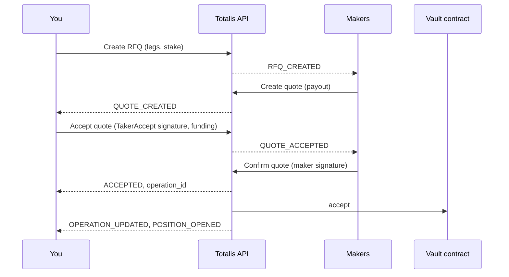

You open a position by asking makers to price your legs, accepting the quote you want with your
wallet's signature, and letting the maker confirm it. The accept call returns the final answer, and
Totalis executes the trade on-chain. Any USDC your vault balance is short of the stake comes from your
wallet inside the same accept: there is no deposit step.



## Before you start

| You need | Where |
| --- | --- |
| A personal API key with the taker scopes | [Recommended scope sets](/hyperliquid/authentication#recommended-scope-sets) |
| Your exported wallet key, to sign | [Export your wallet key](/hyperliquid/authentication#export-your-wallet-key). Read the known limitation there first. |
| USDC on HyperEVM in your Totalis balance | Send native USDC on HyperEVM to your `wallet` address. The token is `usdc.address` in [Get deployment](/hyperliquid/api-reference/deployment/get-deployment). To fund from another chain, deposit in the [Totalis app](https://totalis-hip4.vercel.app), which bridges it. |

Totalis pays the gas for the trade, so your wallet needs no HYPE.

## The flow

| Step | Raw API | SDK |
| --- | --- | --- |
| 1. Subscribe to your account | [Open stream](/hyperliquid/api-reference/streams/open-stream) with an `account` subscription | `totalis.stream`, opened on first use |
| 2. Create the RFQ | [Create RFQ](/hyperliquid/api-reference/rfqs/create-rfq) | `totalis.openPosition({ legs, stake })` does steps 1 to 5 |
| 3. Collect quotes | `QUOTE_CREATED` and `QUOTE_REMOVED` on the stream | `choose` (default `bestQuote()`) |
| 4. Sign and accept one | [Accept quote](/hyperliquid/api-reference/quotes/accept-quote) | `openPosition` |
| 5. Recover a lost accept | [Get acceptance](/hyperliquid/api-reference/quotes/get-acceptance), then [Cancel RFQ](/hyperliquid/api-reference/rfqs/cancel-rfq) | `openPosition` |
| 6. Follow the fill | `OPERATION_UPDATED` on the stream | `totalis.waitForOperation(operationId)` |

With the SDK, the whole flow is one call:

```ts
import { createTotalis } from "@totalistrading/hip4-client";
import { privateKeyToAccount } from "viem/accounts";

const totalis = createTotalis({
  environment: "production",
  accessToken: process.env.TOTALIS_API_KEY!, // ttk_v1_prd_...
  signer: privateKeyToAccount(process.env.TOTALIS_WALLET_KEY as `0x${string}`),
});

const opened = await totalis.openPosition({
  legs: [{ outcome_id: "1209", side: "YES" }, { outcome_id: "1211", side: "NO" }],
  stake: 25_000_000n, // 25 USDC
});

if (opened.status === "ACCEPTED") {
  const fill = await totalis.waitForOperation(opened.operationId!);
  console.log(fill.status, opened.positionId); // COMMITTED: the position exists
} else {
  console.log(`not opened: ${opened.status}`);
}
totalis.close();
```

`openPosition` returns `rfqId`, `acceptanceId`, `quoteId`, `positionId`, the accepted `entry` terms,
`status` and `operationId`. `positionId` equals `quoteId`: an entry position is named by the quote
that opened it.

## Subscribe to your account

Quotes arrive on your account stream, not from a route. Connect and send an `account` subscription as
shown on [Account subscription](/hyperliquid/account-stream), then wait for the snapshot before you
create the RFQ, so no quote is missed.

## Create the RFQ

A leg is one outcome and one side. One leg is a single. Two or more is a parlay. Legs go in strictly
ascending `outcome_id` order, with no outcome twice.

<CodeGroup>
```ts SDK
// openPosition creates the RFQ for you; with the typed client alone:
import { createClient, unwrap, uuidv7 } from "@totalistrading/hip4-client";

const client = createClient("production", { accessToken: process.env.TOTALIS_API_KEY });
const { rfq_id } = unwrap(await client.POST("/v1/rfqs", {
  params: { header: { "Idempotency-Key": uuidv7() } },
  body: { stake: "25000000", legs: [{ outcome_id: "1209", side: "YES" }] },
}));
```

```bash curl
curl https://hip4-api.totalis.trade/v1/rfqs \
  -H "Authorization: Bearer $TOTALIS_API_KEY" \
  -H "Idempotency-Key: 01a0df4e-5dc8-71f2-a3d4-c5b6a7988771" \
  -H "Content-Type: application/json" \
  -d '{
    "stake": "25000000",
    "legs": [{ "outcome_id": "1209", "side": "YES" }]
  }'
```
</CodeGroup>

The response is `201` with `rfq_id`. The venue sets the RFQ's `taker` to your wallet, and every quote
names it. The RFQ is open for quotes for a fixed window (see [Limits](/hyperliquid/limits)).

## Collect quotes

Each `QUOTE_CREATED` event for your `rfq_id` carries one whole quote. Each `QUOTE_REMOVED` names a
`quote_id` that left, with `status` `CANCELLED`, `REPLACED` or `ACCEPTED`. A quote stops being
acceptable at its `expiry`, which sends no event, so drop it yourself on the venue clock. Read
[List quotes](/hyperliquid/api-reference/quotes/list-quotes) only after a snapshot that names `quotes`
in `truncated`. Do not poll.

```json
{
  "quote_id": "0x5e5e5e5e5e5e5e5e5e5e5e5e5e5e5e5e5e5e5e5e5e5e5e5e5e5e5e5e5e5e5e5e",
  "rfq_id": "01a0df4e-5e07-7a3c-8f21-d4e6b7a90c1a",
  "kind": "ENTRY",
  "sequence": 48213,
  "entry": {
    "maker_id": "7",
    "legs": [{ "outcome_id": "1209", "side": "YES" }],
    "stake": "25000000",
    "payout": "98500000",
    "fee_bps": 100,
    "taker_fee_bps": 20,
    "taker": "0x1111111111111111111111111111111111111111",
    "expiry": "1790452875",
    "salt": "48151623429108"
  }
}
```

`payout` is what the position pays if every leg wins. `expiry` is unix seconds on the venue clock.

To pick the quote yourself, pass `choose`. It receives the quotes for exactly your taker, stake and
legs, and the venue clock, and returns one quote, or `undefined` to wait for more:

```ts
const opened = await totalis.openPosition({
  legs: [{ outcome_id: "1209", side: "YES" }],
  stake: 25_000_000n,
  quoteTimeoutMs: 10_000, // cancel the RFQ if nothing acceptable arrives
  // Take the highest payout that pays at least 3x and has 5 seconds left.
  choose: (quotes, serverNowMs) => quotes
    .filter((quote) => BigInt(quote.entry.payout) >= 75_000_000n)
    .filter((quote) => Number(quote.entry.expiry) * 1000 - serverNowMs >= 5_000)
    .sort((a, b) => (BigInt(b.entry.payout) > BigInt(a.entry.payout) ? 1 : -1))[0],
});
```

The default, `bestQuote()`, takes the highest payout with at least 5 seconds left. To render live
quotes in a UI, `totalis.watchQuotes(rfqId, listener)` reports them, and reports `[]` while the stream
is down.

## Sign and accept

Sign the quote's exact `entry` terms as `TakerAccept`, then accept. The `Idempotency-Key` is required:
it is a UUIDv7 you make before the first send, and it becomes the `acceptance_id`. Resend the identical
request under the same key if a response is lost.

<CodeGroup>
```ts SDK
// openPosition signs and accepts for you; by hand:
import { toTotalisSigner, uuidv7 } from "@totalistrading/hip4-client";
import { takerAcceptTypedData } from "@totalistrading/hip4-client/typed-data";

const wallet = toTotalisSigner(privateKeyToAccount(process.env.TOTALIS_WALLET_KEY as `0x${string}`));
const deployment = await totalis.deployment(); // GET /v1/deployment
const taker_signature = await wallet.signTypedData(takerAcceptTypedData(deployment, quote.entry));
const acceptanceId = uuidv7(); // the Idempotency-Key, reused for every resend

const acceptance = unwrap(await client.POST("/v1/quotes/{quote_id}/accept", {
  params: { path: { quote_id: quote.quote_id }, header: { "Idempotency-Key": acceptanceId } },
  body: { taker_signature },
}));
```

```bash curl
curl https://hip4-api.totalis.trade/v1/quotes/$QUOTE_ID/accept \
  -H "Authorization: Bearer $TOTALIS_API_KEY" \
  -H "Idempotency-Key: $ACCEPTANCE_ID" \
  -H "Content-Type: application/json" \
  -d '{ "taker_signature": "0xabab...ab1b" }'
```
</CodeGroup>

The venue asks the maker to confirm and holds the response until the maker answers or the confirm
deadline passes (see [Limits](/hyperliquid/limits)). The response is the acceptance:

```json
{
  "acceptance_id": "01a0df4e-6269-78d2-a4f6-a1b3c5d7e9f8",
  "quote_id": "0x5e5e5e5e5e5e5e5e5e5e5e5e5e5e5e5e5e5e5e5e5e5e5e5e5e5e5e5e5e5e5e5e",
  "rfq_id": "01a0df4e-5e07-7a3c-8f21-d4e6b7a90c1a",
  "status": "ACCEPTED",
  "deadline": "2026-09-26T20:00:53.352Z",
  "operation_id": "0x9a9a9a9a9a9a9a9a9a9a9a9a9a9a9a9a9a9a9a9a9a9a9a9a9a9a9a9a9a9a9a9a"
}
```

### Funding

If your free vault balance is short of the stake, add `funding` to the accept. The vault draws exactly
the shortfall from your wallet in the same transaction as the trade, so a failed trade never leaves a
stray deposit. The accept needs `funding:deposit` only when it carries funding.

| `funding` in `openPosition` | What it does |
| --- | --- |
| `"wallet"` (default) | Signs a USDC `ReceiveWithAuthorization` for exactly the shortfall and sends it as `{ "kind": "WALLET", ... }`. Nothing is signed when the vault covers the stake. |
| `"none"` | Never funds. The vault balance must cover the stake. |
| A funding command | Sent as is: `kind: "CORE"` pays from your HyperCore spot USDC, `kind: "COMBINED"` splits between HyperCore and the wallet. |

Without the SDK, build the wallet authorization with `receiveWithAuthorizationTypedData` (see
[Signing](/hyperliquid/signing)) and send `kind`, `value`, `valid_after`, `valid_before`, `salt` and
`authorization_signature` as `funding`. `value` must equal the shortfall: the stake minus your free
vault balance (`VAULT_FREE` in [Get balances](/hyperliquid/api-reference/account/get-balances)). The
venue fills in your wallet. The authorization window is on [Limits](/hyperliquid/limits).

### Results

The accept never answers `PENDING_CONFIRM`. It answers once the maker has decided:

| `status` | Meaning | Do next |
| --- | --- | --- |
| `ACCEPTED` | The maker confirmed and the trade is queued on-chain as `operation_id`. | [Follow the fill](#follow-the-fill). |
| `PENDING_FUNDING` | The maker confirmed and the trade waits for a HyperCore payment. Only a `CORE` or `COMBINED` funding returns it. | Follow the acceptance until it is `ACCEPTED` or `CANCELLED`. |
| `DECLINED` | The maker declined. Nothing traded. | Open again, which creates a new RFQ. |
| `TIMED_OUT` | The maker did not answer by the deadline. Nothing traded. | Open again. |
| `CANCELLED` | The quote or RFQ stopped being available first, or the HyperCore funding failed. Nothing traded. | Open again. |
| `NOT_ADMITTED` (SDK only) | Every response was lost and the venue never received the accept. The SDK cancelled the RFQ. Nothing traded. | Open again. |

Read later, an acceptance also shows `FILLED` (its operation committed) or `FAILED` (it reverted or
expired unexecuted).

## Recover a lost accept

Resend the identical request under the same `Idempotency-Key`: the venue replays the acceptance and
never restarts its deadline. If you cannot resend it, read
[Get acceptance](/hyperliquid/api-reference/quotes/get-acceptance) by `quote_id`. A `404` means no accept
was admitted yet: [cancel the RFQ](/hyperliquid/api-reference/rfqs/cancel-rfq), which stops any delayed
accept, then read once more. A `404` after the cancel is final and nothing traded. Never accept the
same quote under a second key. `openPosition` runs this recovery for you.

## Follow the fill

`ACCEPTED` means queued, not executed. Follow the operation on the stream until it is terminal:

| Operation `status` | Meaning |
| --- | --- |
| `QUEUED`, `IN_FLIGHT`, `RETRYABLE`, `UNKNOWN` | In progress. |
| `COMMITTED` | The position exists on-chain. `transaction_hash` is set, and `POSITION_OPENED` follows. |
| `REVERTED`, `EXPIRED_UNEXECUTED` | The trade did not happen and no stake was taken. Open again. |

`totalis.waitForOperation(operationId)` does this. Without the SDK, apply `OPERATION_UPDATED` events
for the `operation_id`, and read [Get operation](/hyperliquid/api-reference/account/get-operation) after
a reconnect.

Then read the position by its ID, the `quote_id` you accepted:

<CodeGroup>
```ts SDK
const { position } = unwrap(await totalis.client.GET("/v1/me/positions/{position_id}", {
  params: { path: { position_id: opened.positionId } },
}));
console.log(position.status, position.payout); // OPEN, atomic USDC
```

```bash curl
curl https://hip4-api.totalis.trade/v1/me/positions/$POSITION_ID \
  -H "Authorization: Bearer $TOTALIS_API_KEY"
```
</CodeGroup>

What happens next is on [Cash out a position](/hyperliquid/cash-out) and
[Settlement](/hyperliquid/settlement).

## Errors to handle

The SDK resends `BACKOFF` errors and throws `ApiError` for the rest. Every code is on
[Errors](/hyperliquid/errors).

| Code | Cause | Do |
| --- | --- | --- |
| `FORBIDDEN` | The key lacks a scope, often `quote:accept`, `sponsorship:use` or `funding:deposit`. | Use the [taker scopes](/hyperliquid/authentication#recommended-scope-sets). |
| `WRONG_AUTHORITY` | The signature is not from the RFQ's taker. | Sign with the wallet in `GET /v1/me`. |
| `INVALID_SIGNATURE` | The signature does not verify for the quote's terms. | Sign the quote exactly as received. |
| `QUOTE_EXPIRED`, `QUOTE_CANCELLED`, `QUOTE_REPLACED`, `RFQ_NOT_OPEN` | The quote or RFQ changed before your accept. | Open again. |
| `QUOTE_CAPACITY_EXCEEDED` | The maker can no longer back the quote. | Open again. |
| `STATE_CONFLICT` | The RFQ already has a live acceptance, or the funding no longer matches the shortfall. | Read the acceptance, or your balance, then decide. |
| `RFQ_INTENT_LIMIT` | Too many open RFQs on the account. | Wait for open RFQs to close. |
| `FINANCIAL_ACTIONS_DISABLED` | Trading is paused. | Retry after `Retry-After`. |
| `TimeoutError` (SDK, not an `ApiError`) | No acceptable quote arrived within `quoteTimeoutMs`. The RFQ was cancelled. | Retry, or relax `choose`. |
