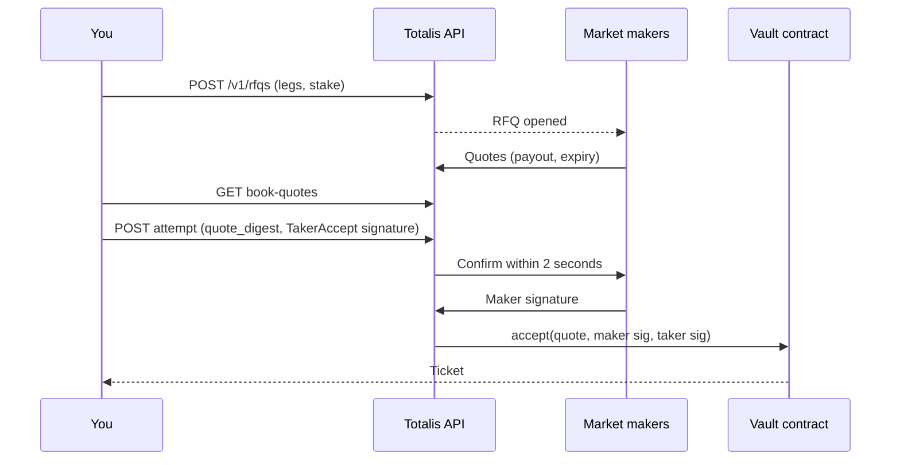

You place a bet by asking market makers to price it, taking the quote you like, and signing that
exact quote with your wallet. The API key authenticates every call. The wallet signature is what the
vault contract executes.



The examples use TypeScript with [viem](https://viem.sh) for signing and
[uuid](https://www.npmjs.com/package/uuid) for UUIDv7. Any EIP-712 library works.

## Before you start

| You need | Where |
| --- | --- |
| A personal API key with the taker bot scopes | [Authentication](/hyperliquid/authentication#recommended-scope-sets) |
| The private key of your Totalis wallet | App, Account, then Private key. See [Keys and signatures](/hyperliquid/authentication#keys-and-signatures). |
| USDC in your vault balance | [Deposit](/hyperliquid/funding#deposit-into-the-vault) over the API, or in the [Totalis app](https://app.totalis.trade). The stake is taken from your vault balance. |

## 1. Set up a client

Every command is a `POST` with the same envelope and its own `Idempotency-Key`. Build the request
once, so a retry resends exactly the same bytes:

```ts
import { v7 as uuidv7 } from "uuid";
import { privateKeyToAccount } from "viem/accounts";

const BASE = "https://hip4-api.totalis.trade";
const KEY = process.env.TOTALIS_HL_API_KEY!;
const wallet = privateKeyToAccount(process.env.TOTALIS_WALLET_PRIVATE_KEY as `0x${string}`);

async function get(path: string) {
  const res = await fetch(BASE + path, { headers: { Authorization: `Bearer ${KEY}` } });
  if (!res.ok) throw await res.json();
  return res.json();
}

type Request = { path: string; idempotencyKey: string; body?: string };

// Builds a command request once. Keep it until you have a response.
function request(path: string, command: object, idempotencyKey = uuidv7()): Request {
  const body = JSON.stringify({
    schema_version: 1,
    request_id: uuidv7(),
    sent_at: new Date().toISOString(),
    command,
  });
  return { path, idempotencyKey, body };
}

async function send({ path, idempotencyKey, body }: Request) {
  const res = await fetch(BASE + path, {
    method: "POST",
    headers: {
      Authorization: `Bearer ${KEY}`,
      "Idempotency-Key": idempotencyKey,
      ...(body ? { "Content-Type": "application/json" } : {}),
    },
    body,
  });
  if (!res.ok) throw await res.json();
  return res.status === 204 ? null : res.json();
}

const command = (path: string, cmd: object, idempotencyKey?: string) =>
  send(request(path, cmd, idempotencyKey));
```

If a request times out, call `send` again with the **same** `Request`. You get the original result
instead of a second bet. See [Idempotency](/hyperliquid/conventions#idempotency).

## 2. Read your wallet, the vault, and your balance

```ts
const me = await get("/v1/me");
const taker = me.wallets[0].address; // must be the wallet you sign with
if (taker !== wallet.address.toLowerCase()) throw new Error("exported key is not your Totalis wallet");

const vault = await get("/v1/vault"); // { chain_id: "999", vault_address: "0xedf7...", ... }
const { balances } = await get("/v1/me/balances");
const vaultUsdc = BigInt(balances.find((b: any) => b.kind === "USER")?.amount ?? "0");
```

`vault.chain_id` and `vault.vault_address` go into every signature's EIP-712 domain. Read them from
the API rather than hard-coding them. `vaultUsdc` is your vault balance, which the stake is taken
from. To top it up, see [Funding](/hyperliquid/funding).

## 3. Choose your legs

A leg is one outcome and a side. `side` is `0` for YES and `1` for NO.

```ts
const { items } = await get("/v1/markets?limit=50");
const legs = [
  { outcome_id: Number(items[0].outcome_id), side: 0 },
  { outcome_id: Number(items[1].outcome_id), side: 1 },
].sort((a, b) => a.outcome_id - b.outcome_id);
```

One leg is a single. Two or more is a parlay. Legs must be in strictly ascending `outcome_id` order
with no outcome repeated. Leg and stake limits are on
[Limits and timing](/hyperliquid/conventions#limits-and-timing).

## 4. Create the RFQ

```ts
const { rfq_id } = await command("/v1/rfqs", {
  taker_address: taker,
  stake_amount: "25000000", // 25 USDC
  legs,
});
```

Market makers see the RFQ immediately and start quoting. It stays open for quotes for 20 seconds.
Nothing in this request is signed. To stop early, call
[Cancel RFQ](/hyperliquid/api-reference/rfqs-and-quotes/cancel-rfq).

## 5. Read the quotes

```ts
async function bestQuote(rfqId: string) {
  const { quotes, server_time } = await get(`/v1/rfqs/${rfqId}/book-quotes`);
  const now = Date.parse(server_time) / 1000;
  return quotes
    .filter((q: any) => Number(q.quote.expiry) - now > 5) // leave time to sign and confirm
    .sort((a: any, b: any) => Number(BigInt(b.quote.payout) - BigInt(a.quote.payout)))[0];
}

let best;
for (let i = 0; i < 20 && !best; i++) {
  best = await bestQuote(rfq_id);
  if (!best) await new Promise((r) => setTimeout(r, 500));
}
if (!best) throw new Error("no usable quote; create a new RFQ");
```

Each quote carries the full terms you will sign:

```json
{
  "quote_digest": "0x6f1c...",
  "quote": {
    "maker_id": "42",
    "legs": [{ "outcome_id": 1209, "side": 0 }, { "outcome_id": 1473, "side": 1 }],
    "stake": "25000000",
    "payout": "61000000",
    "fee_bps": 100,
    "taker_fee_bps": 20,
    "taker": "0x...",
    "expiry": "1790251226",
    "salt": "8123..."
  },
  "rfq_id": "0199...",
  "sequence": 3,
  "chain_id": "999",
  "vault_address": "0xedf7131c57e0ac4eade509e1bf56a9ab7af43745"
}
```

`payout` is what the ticket pays if every leg wins. Quotes are short-lived and each has its own
`expiry` (unix seconds). Compare it with `server_time`, not your local clock. For push updates
instead of polling, see [Realtime](#realtime-instead-of-polling).

## 6. Sign and take the quote

Sign the quote's exact fields as an EIP-712 `TakerAccept`:

```ts
const q = best.quote;
const takerSignature = await wallet.signTypedData({
  domain: {
    name: "TotalisParlay",
    version: "1",
    chainId: Number(vault.chain_id),
    verifyingContract: vault.vault_address,
  },
  types: {
    TakerAccept: [
      { name: "makerId", type: "uint64" },
      { name: "legs", type: "Leg[]" },
      { name: "stake", type: "uint128" },
      { name: "payout", type: "uint128" },
      { name: "feeBps", type: "uint16" },
      { name: "takerFeeBps", type: "uint16" },
      { name: "taker", type: "address" },
      { name: "expiry", type: "uint64" },
      { name: "salt", type: "uint256" },
    ],
    Leg: [
      { name: "outcomeId", type: "uint32" },
      { name: "side", type: "uint8" },
    ],
  },
  primaryType: "TakerAccept",
  message: {
    makerId: BigInt(q.maker_id),
    legs: q.legs.map((l: any) => ({ outcomeId: l.outcome_id, side: l.side })),
    stake: BigInt(q.stake),
    payout: BigInt(q.payout),
    feeBps: q.fee_bps,
    takerFeeBps: q.taker_fee_bps,
    taker: q.taker,
    expiry: BigInt(q.expiry),
    salt: BigInt(q.salt),
  },
});
```

Then start an attempt. The attempt ID is a UUIDv7 you generate, and it doubles as the
`Idempotency-Key`:

```ts
const attemptId = uuidv7();
let attempt = await command(
  `/v1/rfqs/${rfq_id}/attempts/${attemptId}`,
  { quote_digest: best.quote_digest, taker_signature: takerSignature },
  attemptId,
);
```

The maker now has 2 seconds to countersign. Poll the attempt until it leaves `AWAITING_MAKER`:

```ts
while (attempt.state === "AWAITING_MAKER") {
  await new Promise((r) => setTimeout(r, 250));
  attempt = await get(`/v1/rfqs/${rfq_id}/attempts/${attemptId}`);
}
```

| `state` | Meaning | Do next |
| --- | --- | --- |
| `COMMITTED` | The maker signed and the trade is queued on-chain. `operation_id` is set. | Step 7. |
| `DECLINED`, `TIMED_OUT`, `WITHDRAWN` | The maker did not confirm. Nothing was traded. | Pick another quote from the book and start a new attempt, or create a new RFQ. |
| `ABANDONED` | You abandoned the attempt. | Start a new attempt if you still want the bet. |

Nothing falls back to another quote automatically. If you lose the response to the attempt request,
read the attempt by the same ID. Do not start a second one.

## 7. Wait for the trade to land

`COMMITTED` means queued, not executed. Follow the operation until the vault transaction finishes:

```ts
let op;
do {
  await new Promise((r) => setTimeout(r, 1000));
  ({ operation: op } = await get(`/v1/operations/${attempt.operation_id}`));
} while (!["COMMITTED", "REVERTED", "EXPIRED_UNEXECUTED"].includes(op.state));
```

| `state` | Meaning |
| --- | --- |
| `DURABLE`, `IN_FLIGHT`, `RETRYABLE`, `UNKNOWN` | Still in progress. Keep waiting. |
| `COMMITTED` | The ticket exists on-chain. `transaction_hash` is set. |
| `REVERTED`, `EXPIRED_UNEXECUTED` | The trade did not happen and no stake was taken. Create a new RFQ. |

## 8. Read your ticket

The ticket ID is the quote digest you took:

```ts
const { ticket } = await get(`/v1/tickets/${best.quote_digest}`);
// ticket.status: OPEN | SETTLED | CLOSED
```

[List tickets](/hyperliquid/api-reference/account/list-tickets) returns all of them.

| `status` | Meaning |
| --- | --- |
| `OPEN` | At least one leg is unresolved. You can cash out. |
| `SETTLED` | Every leg resolved. `settlement_kind` is `WIN`, `PARTIAL`, `LOSS`, or `EARLY_LOST`. Any payout is waiting to be claimed. |
| `CLOSED` | Paid out (`close_reason: CLAIM`) or cashed out (`close_reason: SELL_BACK`). |

## 9. Settlement and payout

You do not have to do anything. Totalis settles tickets once their legs resolve and claims any payout
to the ticket owner automatically. To make it happen sooner, call
[Settle ticket](/hyperliquid/api-reference/funds-and-tickets/settle-ticket) and then
[Claim ticket](/hyperliquid/api-reference/funds-and-tickets/claim-ticket) with an empty `command`.
Neither needs a signature.

```ts
await command(`/v1/tickets/${ticket.ticket_id}/settlements`, {});
await command(`/v1/tickets/${ticket.ticket_id}/claims`, {});
```

## 10. Cash out early

An `OPEN` ticket can be sold back before it resolves. The flow mirrors placing a bet: ask for bids,
take one, and sign it.

```ts
// 1. Ask market makers to bid for the ticket. Bids are collected for 30 seconds.
const cash = await command("/v1/rfqs", { kind: "CASHOUT", ticket_id: ticket.ticket_id });

// 2. Wait for bids and take the highest sell-back bid with time left to sign.
let bid;
for (let i = 0; i < 30 && !bid; i++) {
  const { quotes: bids, server_time } = await get(`/v1/rfqs/${cash.rfq_id}/cashout-book`);
  const now = Date.parse(server_time) / 1000;
  bid = bids
    .filter((b: any) => b.sell_back && Number(b.sell_back.expiry) - now > 5)
    .sort((a: any, b: any) => Number(BigInt(b.sell_back.price) - BigInt(a.sell_back.price)))[0];
  if (!bid) await new Promise((r) => setTimeout(r, 1000));
}
if (!bid) throw new Error("no cashout bid; try again later");

// 3. Start a cashout attempt and wait for the maker's signature.
const cashAttemptId = uuidv7();
let ca = await command(`/v1/rfqs/${cash.rfq_id}/cashout-attempts/${cashAttemptId}`,
  { bid_digest: bid.bid_digest }, cashAttemptId);
while (ca.state === "AWAITING_MAKER") {
  await new Promise((r) => setTimeout(r, 250));
  ca = await get(`/v1/rfqs/${cash.rfq_id}/cashout-attempts/${cashAttemptId}`);
}
if (ca.state !== "CONFIRMED") throw new Error(`cashout ${ca.state}`);

// 4. Countersign the confirmed bid as the owner and submit the sell-back.
const sb = ca.bid.sell_back;
const ownerSignature = await wallet.signTypedData({
  domain: { name: "TotalisParlay", version: "1", chainId: Number(vault.chain_id), verifyingContract: vault.vault_address },
  types: {
    SellBack: [
      { name: "ticketId", type: "bytes32" },
      { name: "price", type: "uint128" },
      { name: "owner", type: "address" },
      { name: "expiry", type: "uint64" },
      { name: "salt", type: "uint256" },
      { name: "legState", type: "bytes32" },
    ],
  },
  primaryType: "SellBack",
  message: {
    ticketId: sb.ticket_id, price: BigInt(sb.price), owner: sb.owner,
    expiry: BigInt(sb.expiry), salt: BigInt(sb.salt), legState: sb.leg_state,
  },
});
const { operation_id } = await command(`/v1/tickets/${ticket.ticket_id}/sell-back`, {
  price: sb.price, owner: sb.owner, expiry: sb.expiry, salt: sb.salt, leg_state: sb.leg_state,
  maker_signature: ca.maker_signature, owner_signature: ownerSignature,
});
```

Follow `operation_id` exactly as in step 7. A `transfer` bid (the bidding maker buys the ticket from you) works the same way through [Transfer ticket](/hyperliquid/api-reference/funds-and-tickets/transfer-ticket)
with a `CashoutTransfer` signature.

## Realtime instead of polling

Open a WebSocket to `wss://hip4-api.totalis.trade/v1/stream` with your key in the `Authorization`
header and subscribe to your account:

```json
{ "type": "session.hello", "schema_version": 1, "client_instance_id": "<uuid>",
  "subscriptions": [{ "topic": "ACCOUNT" }] }
```

| Event | Do |
| --- | --- |
| `BOOK_QUOTES_CHANGED` | Re-read the book for that `rfq_id`. The event is a signal, not a quote. |
| `EXECUTION_REPORT` | Your operation finished. Replaces step 7 polling. |
| `RFQ_CLOSED` | The RFQ ended. A `terminal_reason` of `ACCEPT_REVERTED` or `ACCEPT_EXPIRED_UNEXECUTED` means the trade failed. |
| `BALANCE_CHANGED` | Re-read balances. |

Streaming requires `account:stream`. See [Open realtime stream](/hyperliquid/api-reference/realtime/open-realtime-stream)
for heartbeats, resume cursors, and reconnects.

## Errors to handle

| Response | Cause | Do |
| --- | --- | --- |
| `403 FORBIDDEN` on an attempt | The key lacks `ticket:accept` or `sponsorship:use`. | Add the scope. |
| `403 WRONG_AUTHORITY` | The signature is not from `taker_address`, or signs different fields. | Sign the quote exactly as returned, with the wallet from `/v1/me`. |
| `409 QUOTE_EXPIRED`, `RFQ_NOT_OPEN` | The quote or RFQ ran out of time. | Re-read the book or create a new RFQ. |
| `409 STATE_CONFLICT` | The quote was already taken, or your account is not eligible to trade. | Re-read the RFQ. Check `status` and `financial_signing_state` in `/v1/me`. |
| `409 IDEMPOTENCY_KEY_REUSED` | You reused a key with a different body. | Generate a new key for a new command. |
| `503 FINANCIAL_ACTIONS_DISABLED` | Trading is paused. | Retry later. |

The full envelope and `retry` guidance are on [Conventions](/hyperliquid/conventions#errors).
