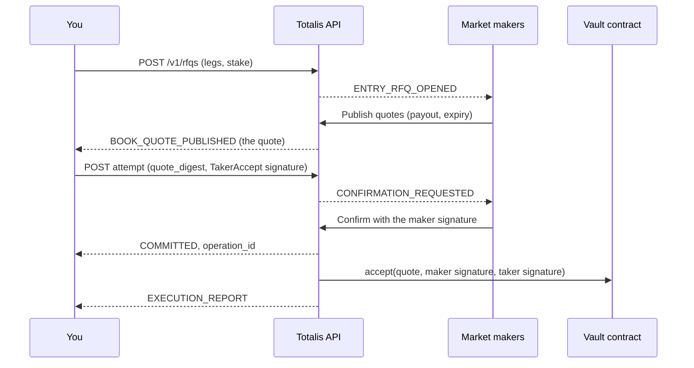

You place a bet by asking market makers to price it, taking the quote you like, and signing that
exact quote with your wallet. The maker confirms within a fixed deadline, and the accept call returns
the final result. The API key authenticates every call. The wallet signature is what the vault
contract executes.


```mermaid
sequenceDiagram
  participant You
  participant API as Totalis API
  participant MM as Market makers
  participant Vault as Vault contract
  You->>API: POST /v1/rfqs (legs, stake)
  API-->>MM: ENTRY_RFQ_OPENED
  MM->>API: Publish quotes (payout, expiry)
  API-->>You: BOOK_QUOTE_PUBLISHED (the quote)
  You->>API: POST attempt (quote_digest, TakerAccept signature)
  API-->>MM: CONFIRMATION_REQUESTED
  MM->>API: Confirm with the maker signature
  API-->>You: COMMITTED, operation_id
  API->>Vault: accept(quote, maker signature, taker signature)
  API-->>You: EXECUTION_REPORT
```

## Before you start

| You need | Where |
| --- | --- |
| A personal API key with the taker bot scopes | [Recommended scope sets](/hyperliquid/authentication#recommended-scope-sets) |
| Your exported Totalis wallet key | [Export your wallet key](/hyperliquid/authentication#export-your-wallet-key). Read the known limitation there first. |
| USDC in your Totalis balance | [Funding](/hyperliquid/funding). The stake comes from your vault balance, and by default a shortfall is topped up from your wallet. |

## 1. Create a client

```ts
import { createTotalis } from "@totalistrading/hip4-client";
import { privateKeyToAccount } from "viem/accounts";

const totalis = createTotalis({
  environment: "production",
  accessToken: process.env.TOTALIS_API_KEY!, // ttk_v1_prd_...
  signer: privateKeyToAccount(process.env.TOTALIS_WALLET_KEY as `0x${string}`),
});
```

The client opens your account stream on first use and follows every step on it. See
[TypeScript SDK](/hyperliquid/sdk) for install and options.

## 2. Place a bet

A leg is one outcome and a side: `side` is `0` for YES and `1` for NO. One leg is a single. Two or
more is a parlay.

```ts
const bet = await totalis.placeBet({
  legs: [{ outcome_id: 1209, side: 0 }, { outcome_id: 1211, side: 1 }],
  stake: 25_000_000n, // 25 USDC
});

if (bet.state === "COMMITTED") {
  const operation = await totalis.waitForOperation(bet.operationId!);
  console.log(operation.state, operation.transaction_hash); // COMMITTED: the ticket exists
} else {
  console.log(`not filled: ${bet.state}`); // DECLINED, TIMED_OUT, WITHDRAWN or NOT_ADMITTED
}
totalis.close();
```

`placeBet` resolves with the final result of one accept:

| `state` | Meaning | Do next |
| --- | --- | --- |
| `COMMITTED` | The maker confirmed and the trade is queued on-chain. `operationId` is set. | Follow it with `waitForOperation` (step 3). |
| `CONFIRMED` | The maker confirmed and the trade waits for a HyperCore funding payment. Only an accept funded from HyperCore returns it. | Follow the attempt on the stream until it is `COMMITTED` or `WITHDRAWN`. |
| `DECLINED`, `TIMED_OUT`, `WITHDRAWN` | The maker did not confirm. Nothing was traded. | Call `placeBet` again for a new RFQ. |
| `NOT_ADMITTED` | Every response to the accept was lost, and the venue never received it. The SDK cancelled the RFQ so it cannot arrive later. Nothing was traded. | Call `placeBet` again. |

It also returns `rfqId`, `attemptId`, `quote`, and `quoteDigest`. The quote digest is the ticket ID
of the position you get.

### What `placeBet` does

| Step | The SDK | Raw API |
| --- | --- | --- |
| 1 | Waits until the account stream is live, so no quote is missed | [`GET /v1/stream`](/hyperliquid/realtime), topic `ACCOUNT` |
| 2 | Creates the RFQ with your wallet as taker and the legs sorted by `outcome_id` | [Create RFQ](/hyperliquid/api-reference/rfqs-and-quotes/create-rfq) |
| 3 | Keeps the book from the stream: the snapshot's `book_quotes`, then `BOOK_QUOTE_PUBLISHED` and `BOOK_QUOTE_REMOVED`. Reads the book over HTTP only after a snapshot that truncated `book_quotes`. | [List book](/hyperliquid/api-reference/recovery/list-book) (recovery) |
| 4 | Offers only quotes for exactly your taker, stake, and legs to `choose`. The default takes the highest payout with at least 5 seconds left. | None |
| 5 | Signs `TakerAccept` over the chosen quote with your signer | None |
| 6 | If the vault balance is short, signs a USDC authorization for exactly the shortfall and attaches it as `funding` | [Get balances](/hyperliquid/api-reference/account/get-balances) |
| 7 | Sends one accept and returns its final result | [Accept quote](/hyperliquid/api-reference/rfqs-and-quotes/accept-quote) |
| 8 | If every response to the accept is lost, reads the attempt. If the venue never received it, cancels the RFQ and reads once more. | [Get attempt](/hyperliquid/api-reference/recovery/get-attempt) (recovery), [Cancel RFQ](/hyperliquid/api-reference/rfqs-and-quotes/cancel-rfq) |
| 9 | Cancels the RFQ if no acceptable quote arrives within `quoteTimeoutMs` (default 20 seconds) | [Cancel RFQ](/hyperliquid/api-reference/rfqs-and-quotes/cancel-rfq) |

### Choose your own quote

Pass `choose` to pick from the book yourself. It gets the quotes for your bet and the venue clock,
and returns one quote, or `undefined` to wait for the book to change:

```ts
const bet = await totalis.placeBet({
  legs: [{ outcome_id: 1209, side: 0 }],
  stake: 25_000_000n,
  funding: "none", // never fund from the wallet: the vault balance must cover the stake
  quoteTimeoutMs: 10_000,
  // Take the highest payout that pays at least 3x and has 5 seconds left.
  choose: (quotes, serverNowMs) => quotes
    .filter((entry) => BigInt(entry.quote.payout) >= 75_000_000n)
    .filter((entry) => Number(entry.quote.expiry) * 1000 - serverNowMs >= 5_000)
    .sort((a, b) => (BigInt(b.quote.payout) > BigInt(a.quote.payout) ? 1 : -1))[0],
});
```

Each quote carries the full terms you sign:

```json
{
  "quote_digest": "0x5e5e5e5e5e5e5e5e5e5e5e5e5e5e5e5e5e5e5e5e5e5e5e5e5e5e5e5e5e5e5e5e",
  "kind": "ENTRY",
  "quote": {
    "maker_id": "7",
    "legs": [{ "outcome_id": 1209, "side": 0 }],
    "stake": "25000000",
    "payout": "98500000",
    "fee_bps": 100,
    "taker_fee_bps": 20,
    "taker": "0x1111111111111111111111111111111111111111",
    "expiry": "1790452875",
    "salt": "48151623429108"
  },
  "rfq_id": "01a0df4e-5e07-7a3c-8f21-d4e6b7a90c1a",
  "sequence": 48213,
  "chain_id": "999",
  "vault_address": "0xedf7131c57e0ac4eade509e1bf56a9ab7af43745"
}
```

`payout` is what the ticket pays if every leg wins. `expiry` is in unix seconds. Compare it with the
venue clock (`serverNowMs`), not your own. To render a live book in a UI, use
`totalis.watchBook(rfqId, listener)`, which reports an empty book while the stream is down.

### Without the SDK

Each call below is what `placeBet` sends. Commands carry the [envelope and
`Idempotency-Key`](/hyperliquid/conventions#commands-and-idempotency) described on Conventions.

<Steps>
  <Step title="Open the account stream">
    Connect to `wss://hip4-api.totalis.trade/v1/stream` and subscribe to `ACCOUNT`, as shown on
    [Realtime](/hyperliquid/realtime). Wait for the snapshot before creating the RFQ. Its
    `book_quotes` holds the live quotes on your open RFQs.
  </Step>
  <Step title="Create the RFQ">
    ```bash
    curl https://hip4-api.totalis.trade/v1/rfqs \
      -H "Authorization: Bearer $TOTALIS_API_KEY" \
      -H "Idempotency-Key: 01a0df4e-5dc8-71f2-a3d4-c5b6a7988771" \
      -H "Content-Type: application/json" \
      -d '{
        "schema_version": 1,
        "request_id": "01a0df4e-5dc9-7a10-9b2e-3c4d5e6f7a81",
        "sent_at": "2026-09-26T20:00:50.120Z",
        "command": {
          "taker_address": "0x1111111111111111111111111111111111111111",
          "stake_amount": "25000000",
          "legs": [{ "outcome_id": 1209, "side": 0 }]
        }
      }'
    ```

    The response is `201` with `rfq_id`. `taker_address` is your `signer` from `GET /v1/me`. Legs are
    in strictly ascending `outcome_id` order with no outcome twice.
  </Step>
  <Step title="Keep the book from the stream">
    Each `BOOK_QUOTE_PUBLISHED` event for your `rfq_id` carries one complete quote, and each
    `BOOK_QUOTE_REMOVED` names the `quote_digest` that left. Expiry sends no event, so drop a quote
    yourself once it is within 2 seconds of its `expiry` on the venue clock. Read
    [List book](/hyperliquid/api-reference/recovery/list-book) only after a snapshot that truncated
    `book_quotes`. Do not poll.
  </Step>
  <Step title="Sign the quote">
    Sign the quote's exact terms as `TakerAccept` with the SDK's typed-data builder:

    ```ts
    import { toTotalisSigner, uuidv7 } from "@totalistrading/hip4-client";
    import { takerAcceptTypedData } from "@totalistrading/hip4-client/typed-data";
    import { privateKeyToAccount } from "viem/accounts";

    const wallet = toTotalisSigner(privateKeyToAccount(process.env.TOTALIS_WALLET_KEY as `0x${string}`));

    // `release` is GET /v1/vault; `entry` is the payload of a BOOK_QUOTE_PUBLISHED event.
    const taker_signature = await wallet.signTypedData(takerAcceptTypedData(release, entry.quote));
    const attemptId = uuidv7(); // also the Idempotency-Key
    ```
  </Step>
  <Step title="Accept it">
    ```bash
    curl https://hip4-api.totalis.trade/v1/rfqs/$RFQ_ID/attempts/$ATTEMPT_ID \
      -H "Authorization: Bearer $TOTALIS_API_KEY" \
      -H "Idempotency-Key: $ATTEMPT_ID" \
      -H "Content-Type: application/json" \
      -d '{
        "schema_version": 1,
        "request_id": "01a0df4e-626e-7c7d-8e9f-a0b1c2d3e4fc",
        "sent_at": "2026-09-26T20:00:51.310Z",
        "command": { "quote_digest": "0x5e5e...5e5e", "taker_signature": "0xabab...ab1b" }
      }'
    ```

    The response is held until the maker answers or the confirmation deadline passes, and is always
    final: `COMMITTED` with `operation_id`, or `DECLINED`, `TIMED_OUT`, or `WITHDRAWN`. To fund a
    vault shortfall in the same call, add `funding` (see
    [Accept quote](/hyperliquid/api-reference/rfqs-and-quotes/accept-quote)). If the response is
    lost, resend the identical request, which replays the result. If you cannot resend it, read
    [Get attempt](/hyperliquid/api-reference/recovery/get-attempt). A `404` means the venue has not
    received it: cancel the RFQ, then read again, and a `404` after the cancel is final. Never read
    the attempt to wait, and do not start a second attempt for the same quote.
  </Step>
</Steps>

## 3. Follow the trade on-chain

`COMMITTED` means the trade is queued, not executed. `waitForOperation` follows the operation on the
stream (`EXECUTION_REPORT`) until it is terminal:

| `state` | Meaning |
| --- | --- |
| `DURABLE`, `IN_FLIGHT`, `RETRYABLE`, `UNKNOWN` | Still in progress. |
| `COMMITTED` | The ticket exists on-chain. `transaction_hash` is set. |
| `REVERTED`, `EXPIRED_UNEXECUTED` | The trade did not happen and no stake was taken. Place a new bet. |

Without the SDK, apply `EXECUTION_REPORT` events for the `operation_id`, and read
[Get operation](/hyperliquid/api-reference/recovery/get-operation) after a reconnect.

## 4. Read your position

A ticket is read as a position. Its ID is the quote digest you took:

```ts
import { unwrap } from "@totalistrading/hip4-client";

const ticketId = bet.quoteDigest;
const { position } = unwrap(await totalis.client.GET("/v1/me/positions/{ticket_id}", {
  params: { path: { ticket_id: ticketId } },
}));
const payout = position.signed_payout; // an amount fact: a value, or UNAVAILABLE with a reason
console.log(position.status, payout.status === "UNAVAILABLE" ? payout.reason : payout.value);
```

| `status` | Meaning |
| --- | --- |
| `OPEN` | At least one leg is unresolved. You can cash out. |
| `AWAITING_SETTLEMENT` | Every leg resolved, or a leg lost, and settlement has not landed yet. |
| `SETTLED_UNCLAIMED` | Settled. `settlement_kind` is `WIN`, `PARTIAL`, `LOSS`, or `EARLY_LOST`, and Totalis has not claimed any payout yet. |
| `CLOSED` | Paid out (`close_reason: CLAIM`) or cashed out (`close_reason: SELL_BACK`). |

[List account positions](/hyperliquid/api-reference/account/list-account-positions) returns all of
them, a page at a time. Amounts in position reads are amount facts: each carries `value` when known,
or `status: "UNAVAILABLE"` with a `reason`.

## 5. Settlement and payout

You do nothing. Totalis settles every decided ticket and claims any payout into the owner's vault
balance automatically. There is no call to make, no scope to hold, and nothing to sign. The stream
reports each step as `TICKET_SETTLED` and then `TICKET_CLOSED`: re-read the position to see
`settlement_kind` and `close_reason`.

## 6. Cash out early

An `OPEN` ticket can be sold back before it resolves. The flow is the same as placing a bet, on the
same two routes: create a cash-out RFQ, take a bid from the book, and accept it. You sign the bid as
the ticket's owner before the accept, so the maker's confirmation executes it.

```ts
const cashout = await totalis.cashOut({ ticketId });
if (cashout.state === "COMMITTED") await totalis.waitForOperation(cashout.operationId!);
```

`cashOut` resolves like `placeBet`: `COMMITTED` with the `operationId` of the queued sell-back or
transfer, or `DECLINED`, `TIMED_OUT`, `WITHDRAWN`, or `NOT_ADMITTED` when nothing was sold. Pass
`choose` to pick the bid yourself. The default, `bestBid()`, takes the highest price with at least 25
seconds left, since execution needs time after the maker confirms.

| Step | Raw API |
| --- | --- |
| Create a cash-out RFQ: `{ "kind": "CASHOUT", "ticket_id": "0x..." }` | [Create RFQ](/hyperliquid/api-reference/rfqs-and-quotes/create-rfq) |
| Keep the bids from the stream, as for quotes: each is a `BOOK_QUOTE_PUBLISHED` with `kind: "CASHOUT"` and a `sell_back` or `transfer` | [Realtime](/hyperliquid/realtime) |
| Sign the bid as the owner: `SellBack` (`sellBackTypedData`) for a `sell_back` bid, `CashoutTransfer` (`cashoutTransferTypedData`) for a `transfer` bid | None |
| Accept it with that signature as `taker_signature`. The response is final. | [Accept quote](/hyperliquid/api-reference/rfqs-and-quotes/accept-quote) |

The accept for a cash-out needs `ticket:cashout` and takes no `funding`.

## Errors to handle

`placeBet` and `cashOut` throw `ApiError` for a registered error after the SDK's own resends. The
full list, with each code's status and retry rule, is on [Errors](/hyperliquid/errors).

| Code | Cause | Do |
| --- | --- | --- |
| `FORBIDDEN` | The key lacks a scope, often `ticket:accept`, `sponsorship:use`, or `funding:deposit`. | Create a key with the [taker bot scopes](/hyperliquid/authentication#recommended-scope-sets). |
| `WRONG_AUTHORITY` | The signature is not from the RFQ's taker. | Sign with the wallet whose address is `signer` in `GET /v1/me`. |
| `INVALID_SIGNATURE` | The signature does not verify for the quote's terms. | Sign the quote exactly as the book returned it. |
| `QUOTE_EXPIRED`, `QUOTE_WITHDRAWN`, `QUOTE_SUPERSEDED`, `RFQ_NOT_OPEN` | The quote or RFQ changed before your accept. | Place the bet again. |
| `QUOTE_CAPACITY_EXCEEDED` | The maker can no longer back the quote. | Place the bet again. |
| `RFQ_INTENT_LIMIT` | Too many open RFQs on the account. | Wait for open RFQs to close, then retry. |
| `FINANCIAL_ACTIONS_DISABLED` | Trading is paused. | Retry after `Retry-After`. |
| `TimeoutError` (not an `ApiError`) | No acceptable quote arrived in time. The RFQ was cancelled. | Retry, or relax `choose`. |
